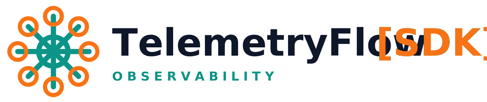

<p align="center">
  <picture>
    <source media="(prefers-color-scheme: dark)" srcset="docs/assets/tfo-logo-sdk-dark.svg">
    <source media="(prefers-color-scheme: light)" srcset="docs/assets/tfo-logo-sdk-light.svg">
    
  </picture>
</p>

<p align="center">
  <a href="https://go.dev/"></a>
  <a href="LICENSE"></a>
  <a href="https://opentelemetry.io/"></a>
  <a href="https://hub.docker.com/r/telemetryflow/telemetryflow-sdk"></a>
  <a href="CHANGELOG.md"></a>
</p>

<p align="center">
  Enterprise-grade Go SDK for <a href="https://telemetryflow.id">TelemetryFlow</a> - the observability platform that provides unified metrics, logs, and traces collection following OpenTelemetry standards.
</p>

---

# Contributing to TelemetryFlow Go SDK

Thank you for your interest in contributing to the TelemetryFlow Go SDK! This document provides guidelines and information for contributors.

## Table of Contents

- [Code of Conduct](#code-of-conduct)
- [Getting Started](#getting-started)
- [Development Setup](#development-setup)
- [Project Structure](#project-structure)
- [Making Changes](#making-changes)
- [Testing](#testing)
- [Submitting Changes](#submitting-changes)
- [Style Guide](#style-guide)
- [Architecture Guidelines](#architecture-guidelines)
- [Release Process](#release-process)

## Code of Conduct

By participating in this project, you agree to maintain a respectful and inclusive environment. We expect all contributors to:

- Be respectful and constructive in discussions
- Welcome newcomers and help them learn
- Focus on what is best for the community
- Show empathy towards other community members

## Getting Started

### Prerequisites

- Go 1.24 or higher
- Git
- Make (optional, for using Makefile commands)

### Fork and Clone

1. Fork the repository on GitHub
2. Clone your fork locally:

```bash
git clone https://github.com/YOUR_USERNAME/telemetryflow-go-sdk.git
cd telemetryflow-go-sdk
```

3. Add the upstream remote:

```bash
git remote add upstream https://github.com/telemetryflow/telemetryflow-go-sdk.git
```

## Development Setup

### Install Dependencies

```bash
go mod download
```

### Verify Setup

```bash
# Run tests
go test ./...

# Run linter (if golangci-lint is installed)
golangci-lint run
```

### IDE Setup

We recommend using an IDE with Go support:

- **VS Code** with the Go extension
- **GoLand** by JetBrains
- **Vim/Neovim** with gopls

## Project Structure

The SDK follows Domain-Driven Design (DDD) and CQRS patterns:

```
telemetryflow-go-sdk/
├── cmd/
│   └── generator/          # CLI code generator tool
├── docs/
│   ├── ARCHITECTURE.md     # Architecture documentation
│   └── QUICKSTART.md       # Quickstart guide
├── examples/
│   ├── basic/              # Basic usage example
│   ├── http-server/        # HTTP server integration
│   ├── worker/             # Background worker example
│   └── grpc-server/        # gRPC server example
├── pkg/telemetryflow/
│   ├── domain/             # Domain layer (entities, value objects)
│   │   ├── config.go       # TelemetryConfig entity
│   │   └── credentials.go  # Credentials value object
│   ├── application/        # Application layer (CQRS)
│   │   ├── commands.go     # Command definitions
│   │   └── queries.go      # Query definitions
│   ├── infrastructure/     # Infrastructure layer
│   │   ├── exporters.go    # OTLP exporter factory
│   │   └── handlers.go     # Command handlers
│   ├── client.go           # Public Client API
│   └── builder.go          # Builder pattern for configuration
├── go.mod
├── go.sum
├── Makefile
└── README.md
```

### Layer Responsibilities

| Layer | Responsibility | Dependencies |
|-------|---------------|--------------|
| **Domain** | Business logic, entities, value objects | None (pure Go) |
| **Application** | Use cases, commands, queries | Domain only |
| **Infrastructure** | Technical implementations, exporters | Domain, Application |
| **Interface** | Public API (Client, Builder) | All layers |

## Making Changes

### Branch Naming

Use descriptive branch names:

- `feature/add-custom-metric-types`
- `fix/connection-timeout-handling`
- `docs/update-api-reference`
- `refactor/simplify-command-handlers`

### Creating a Branch

```bash
# Sync with upstream
git fetch upstream
git checkout main
git merge upstream/main

# Create feature branch
git checkout -b feature/your-feature-name
```

### Commit Messages

Follow conventional commits format:

```
type(scope): short description

Longer description if needed.

Fixes #123
```

**Types:**
- `feat`: New feature
- `fix`: Bug fix
- `docs`: Documentation changes
- `test`: Adding or updating tests
- `refactor`: Code refactoring
- `chore`: Maintenance tasks

**Examples:**

```
feat(metrics): add support for exponential histograms

Implement exponential histogram recording for more efficient
distribution tracking of high-cardinality data.

Fixes #45
```

```
fix(exporter): handle connection timeout gracefully

Added proper timeout handling and retry logic when the
OTLP endpoint is temporarily unavailable.
```

## Testing

### Running Tests

```bash
# Run all tests
go test ./...

# Run tests with verbose output
go test -v ./...

# Run tests with coverage
go test -cover ./...

# Generate coverage report
go test -coverprofile=coverage.out ./...
go tool cover -html=coverage.out -o coverage.html
```

### Writing Tests

Follow these guidelines for tests:

1. **Unit Tests**: Test individual functions and methods in isolation
2. **Integration Tests**: Test interactions between layers
3. **Table-Driven Tests**: Use table-driven tests for multiple scenarios

Example test structure:

```go
func TestCredentials_Validation(t *testing.T) {
    tests := []struct {
        name      string
        keyID     string
        keySecret string
        wantErr   bool
    }{
        {
            name:      "valid credentials",
            keyID:     "tfk_valid_key",
            keySecret: "tfs_valid_secret",
            wantErr:   false,
        },
        {
            name:      "empty key ID",
            keyID:     "",
            keySecret: "tfs_valid_secret",
            wantErr:   true,
        },
        // Add more test cases...
    }

    for _, tt := range tests {
        t.Run(tt.name, func(t *testing.T) {
            _, err := domain.NewCredentials(tt.keyID, tt.keySecret)
            if (err != nil) != tt.wantErr {
                t.Errorf("NewCredentials() error = %v, wantErr %v", err, tt.wantErr)
            }
        })
    }
}
```

### Test Coverage

We aim for high test coverage, especially in:

- Domain layer: 90%+
- Application layer: 85%+
- Infrastructure layer: 80%+

## Submitting Changes

### Before Submitting

1. **Run tests**: `go test ./...`
2. **Run linter**: `golangci-lint run` (if available)
3. **Update documentation** if needed
4. **Add tests** for new functionality

### Pull Request Process

1. Push your branch to your fork:

```bash
git push origin feature/your-feature-name
```

2. Create a Pull Request on GitHub

3. Fill in the PR template with:
   - Description of changes
   - Related issue numbers
   - Testing performed
   - Checklist items

4. Wait for review and address feedback

### PR Title Format

Use the same format as commit messages:

```
feat(metrics): add exponential histogram support
fix(exporter): handle connection timeouts
docs(api): update method signatures
```

## Style Guide

### Go Style

Follow standard Go conventions:

- Use `gofmt` for formatting
- Follow [Effective Go](https://go.dev/doc/effective_go) guidelines
- Use meaningful variable and function names
- Write clear, concise comments

### Naming Conventions

| Type | Convention | Example |
|------|------------|---------|
| Packages | lowercase, single word | `domain`, `application` |
| Interfaces | describe behavior | `CommandHandler`, `Exporter` |
| Structs | PascalCase | `TelemetryConfig`, `Credentials` |
| Methods | PascalCase (exported) | `NewCredentials`, `Handle` |
| Methods | camelCase (unexported) | `validateConfig`, `isInitialized` |
| Constants | PascalCase | `ProtocolGRPC`, `SignalMetrics` |

### Error Handling

- Always check and handle errors
- Wrap errors with context using `fmt.Errorf("context: %w", err)`
- Return errors from lower layers, don't panic

```go
// Good
if err := validate(config); err != nil {
    return fmt.Errorf("invalid configuration: %w", err)
}

// Avoid
if err := validate(config); err != nil {
    panic(err)
}
```

### Documentation

- Document all exported types, functions, and methods
- Use complete sentences starting with the name being documented
- Include examples for complex functionality

```go
// NewCredentials creates a new Credentials value object with the given
// API key ID and secret. It validates the format of both values and
// returns an error if either is invalid.
func NewCredentials(keyID, keySecret string) (*Credentials, error) {
    // ...
}
```

## Architecture Guidelines

When contributing, maintain the architectural principles:

### Domain-Driven Design

1. **Value Objects**: Immutable, validate on creation
2. **Entities**: Have identity, can change state through methods
3. **Aggregate Roots**: Entry point for accessing aggregates

### CQRS Pattern

1. **Commands**: Represent intentions to change state
2. **Queries**: Represent requests for data
3. **Handlers**: Execute commands and queries

### SOLID Principles

1. **Single Responsibility**: One reason to change per type
2. **Open/Closed**: Open for extension, closed for modification
3. **Liskov Substitution**: Subtypes must be substitutable
4. **Interface Segregation**: Small, focused interfaces
5. **Dependency Inversion**: Depend on abstractions

### Adding New Features

When adding new features:

1. Define domain concepts first (if applicable)
2. Create commands/queries in the application layer
3. Implement handlers in the infrastructure layer
4. Expose through the public API (Client)

## Release Process

Releases follow semantic versioning (SemVer):

- **MAJOR**: Breaking API changes
- **MINOR**: New features, backward compatible
- **PATCH**: Bug fixes, backward compatible

### Changelog

Update CHANGELOG.md with your changes under the "Unreleased" section.

## Getting Help

- **Questions**: Open a GitHub Discussion
- **Bugs**: Open a GitHub Issue with the bug template
- **Features**: Open a GitHub Issue with the feature request template
- **Security**: Email security@telemetryflow.id (do not open public issues)

## Recognition

Contributors are recognized in:

- GitHub Contributors page
- CHANGELOG.md for significant contributions
- README.md acknowledgments section

Thank you for contributing to TelemetryFlow Go SDK!

---

Built with care by the **DevOpsCorner Indonesia** community
