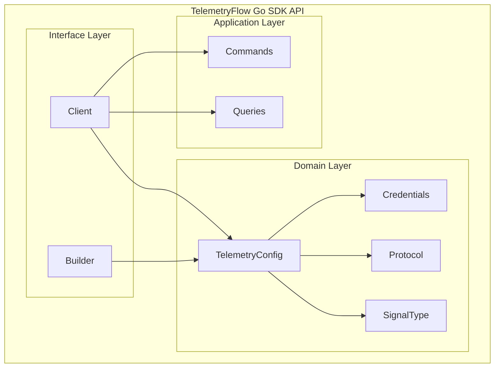

# TelemetryFlow Go SDK - API Reference

Complete API reference for the TelemetryFlow Go SDK.

## Table of Contents

- [Package Overview](#package-overview)
- [Client](#client)
  - [Constructors](#constructors)
  - [Lifecycle Methods](#lifecycle-methods)
  - [Metrics API](#metrics-api)
  - [Logs API](#logs-api)
  - [Traces API](#traces-api)
- [Builder](#builder)
  - [Configuration Methods](#configuration-methods)
  - [Signal Configuration](#signal-configuration)
  - [Build Methods](#build-methods)
- [Domain Types](#domain-types)
  - [Credentials](#credentials)
  - [TelemetryConfig](#telemetryconfig)
  - [Protocol](#protocol)
  - [SignalType](#signaltype)
- [Application Types](#application-types)
  - [Commands](#commands)
  - [Queries](#queries)
- [Constants](#constants)
- [Error Handling](#error-handling)

---

## Package Overview

```go
import "github.com/telemetryflow/telemetryflow-go-sdk/pkg/telemetryflow"
```

The main package provides the public API for interacting with TelemetryFlow.



---

## Client

The `Client` struct is the main entry point for sending telemetry data.

```go
type Client struct {
    // contains filtered or unexported fields
}
```

### Constructors

#### NewClient

Creates a new TelemetryFlow client from a configuration.

```go
func NewClient(config *domain.TelemetryConfig) (*Client, error)
```

**Parameters:**
| Name | Type | Description |
|------|------|-------------|
| `config` | `*domain.TelemetryConfig` | The telemetry configuration |

**Returns:**
| Type | Description |
|------|-------------|
| `*Client` | The configured client |
| `error` | Error if configuration is invalid |

**Example:**
```go
config, _ := domain.NewTelemetryConfig(creds, "api.telemetryflow.id:4317", "my-service")
client, err := telemetryflow.NewClient(config)
if err != nil {
    log.Fatal(err)
}
```

---

#### NewFromEnv

Creates a client from environment variables.

```go
func NewFromEnv() (*Client, error)
```

**Environment Variables:**
| Variable | Required | Default | Description |
|----------|----------|---------|-------------|
| `TELEMETRYFLOW_API_KEY_ID` | Yes | - | API key ID (format: `tfk_...`) |
| `TELEMETRYFLOW_API_KEY_SECRET` | Yes | - | API key secret (format: `tfs_...`) |
| `TELEMETRYFLOW_ENDPOINT` | No | `api.telemetryflow.id:4317` | OTLP endpoint |
| `TELEMETRYFLOW_SERVICE_NAME` | No | `unknown-service` | Service name |
| `TELEMETRYFLOW_SERVICE_VERSION` | No | `1.1.1` | Service version |
| `ENV` or `ENVIRONMENT` | No | `production` | Deployment environment |

**Example:**
```go
client, err := telemetryflow.NewFromEnv()
if err != nil {
    log.Fatal(err)
}
```

---

#### MustNewFromEnv

Creates a client from environment variables, panics on error.

```go
func MustNewFromEnv() *Client
```

**Example:**
```go
client := telemetryflow.MustNewFromEnv()
```

---

#### NewSimple

Creates a client with minimal configuration.

```go
func NewSimple(apiKeyID, apiKeySecret, endpoint, serviceName string) (*Client, error)
```

**Parameters:**
| Name | Type | Description |
|------|------|-------------|
| `apiKeyID` | `string` | API key ID |
| `apiKeySecret` | `string` | API key secret |
| `endpoint` | `string` | OTLP endpoint |
| `serviceName` | `string` | Service name |

**Example:**
```go
client, err := telemetryflow.NewSimple(
    "tfk_your_key",
    "tfs_your_secret",
    "api.telemetryflow.id:4317",
    "my-service",
)
```

---

#### MustNewSimple

Creates a client with minimal configuration, panics on error.

```go
func MustNewSimple(apiKeyID, apiKeySecret, endpoint, serviceName string) *Client
```

---

### Lifecycle Methods

#### Initialize

Initializes the SDK and starts exporters.

```go
func (c *Client) Initialize(ctx context.Context) error
```

**Parameters:**
| Name | Type | Description |
|------|------|-------------|
| `ctx` | `context.Context` | Context for initialization |

**Returns:**
| Type | Description |
|------|-------------|
| `error` | Error if initialization fails or already initialized |

**Example:**
```go
ctx := context.Background()
if err := client.Initialize(ctx); err != nil {
    log.Fatal(err)
}
```

---

#### Shutdown

Gracefully shuts down the SDK.

```go
func (c *Client) Shutdown(ctx context.Context) error
```

**Parameters:**
| Name | Type | Description |
|------|------|-------------|
| `ctx` | `context.Context` | Context for shutdown (respects deadline) |

**Example:**
```go
ctx, cancel := context.WithTimeout(context.Background(), 10*time.Second)
defer cancel()
client.Shutdown(ctx)
```

---

#### Flush

Forces a flush of all pending telemetry.

```go
func (c *Client) Flush(ctx context.Context) error
```

**Parameters:**
| Name | Type | Description |
|------|------|-------------|
| `ctx` | `context.Context` | Context for flush operation |

**Example:**
```go
if err := client.Flush(ctx); err != nil {
    log.Printf("Flush failed: %v", err)
}
```

---

#### IsInitialized

Returns whether the client is initialized.

```go
func (c *Client) IsInitialized() bool
```

---

#### Config

Returns the client configuration.

```go
func (c *Client) Config() *domain.TelemetryConfig
```

---

### Metrics API

#### RecordMetric

Records a generic metric.

```go
func (c *Client) RecordMetric(ctx context.Context, name string, value float64, unit string, attributes map[string]interface{}) error
```

**Parameters:**
| Name | Type | Description |
|------|------|-------------|
| `ctx` | `context.Context` | Request context |
| `name` | `string` | Metric name |
| `value` | `float64` | Metric value |
| `unit` | `string` | Unit of measurement (e.g., "s", "ms", "bytes") |
| `attributes` | `map[string]interface{}` | Additional attributes |

**Example:**
```go
client.RecordMetric(ctx, "request.size", 1024.0, "bytes", map[string]interface{}{
    "endpoint": "/api/users",
})
```

---

#### IncrementCounter

Increments a counter metric.

```go
func (c *Client) IncrementCounter(ctx context.Context, name string, value int64, attributes map[string]interface{}) error
```

**Parameters:**
| Name | Type | Description |
|------|------|-------------|
| `ctx` | `context.Context` | Request context |
| `name` | `string` | Counter name |
| `value` | `int64` | Increment value |
| `attributes` | `map[string]interface{}` | Additional attributes |

**Example:**
```go
client.IncrementCounter(ctx, "http.requests.total", 1, map[string]interface{}{
    "method": "GET",
    "status": 200,
    "path":   "/api/users",
})
```

---

#### RecordGauge

Records a gauge metric (point-in-time value).

```go
func (c *Client) RecordGauge(ctx context.Context, name string, value float64, attributes map[string]interface{}) error
```

**Parameters:**
| Name | Type | Description |
|------|------|-------------|
| `ctx` | `context.Context` | Request context |
| `name` | `string` | Gauge name |
| `value` | `float64` | Current value |
| `attributes` | `map[string]interface{}` | Additional attributes |

**Example:**
```go
client.RecordGauge(ctx, "memory.usage", 512.5, map[string]interface{}{
    "unit": "MB",
    "host": "server-01",
})
```

---

#### RecordHistogram

Records a histogram measurement (for distributions).

```go
func (c *Client) RecordHistogram(ctx context.Context, name string, value float64, unit string, attributes map[string]interface{}) error
```

**Parameters:**
| Name | Type | Description |
|------|------|-------------|
| `ctx` | `context.Context` | Request context |
| `name` | `string` | Histogram name |
| `value` | `float64` | Measured value |
| `unit` | `string` | Unit of measurement |
| `attributes` | `map[string]interface{}` | Additional attributes |

**Example:**
```go
client.RecordHistogram(ctx, "http.request.duration", 0.125, "s", map[string]interface{}{
    "method":   "POST",
    "endpoint": "/api/orders",
})
```

---

### Logs API

#### Log

Emits a structured log entry with custom severity.

```go
func (c *Client) Log(ctx context.Context, severity string, message string, attributes map[string]interface{}) error
```

**Parameters:**
| Name | Type | Description |
|------|------|-------------|
| `ctx` | `context.Context` | Request context |
| `severity` | `string` | Log severity ("debug", "info", "warn", "error") |
| `message` | `string` | Log message |
| `attributes` | `map[string]interface{}` | Additional attributes |

---

#### LogInfo

Emits an info-level log.

```go
func (c *Client) LogInfo(ctx context.Context, message string, attributes map[string]interface{}) error
```

**Example:**
```go
client.LogInfo(ctx, "User logged in successfully", map[string]interface{}{
    "user_id":   "12345",
    "ip":        "192.168.1.1",
    "user_agent": "Mozilla/5.0...",
})
```

---

#### LogWarn

Emits a warning-level log.

```go
func (c *Client) LogWarn(ctx context.Context, message string, attributes map[string]interface{}) error
```

**Example:**
```go
client.LogWarn(ctx, "High memory usage detected", map[string]interface{}{
    "usage_mb":     850,
    "threshold_mb": 800,
    "action":       "scaling recommended",
})
```

---

#### LogError

Emits an error-level log.

```go
func (c *Client) LogError(ctx context.Context, message string, attributes map[string]interface{}) error
```

**Example:**
```go
client.LogError(ctx, "Database connection failed", map[string]interface{}{
    "error":   "connection timeout",
    "host":    "db.example.com",
    "port":    5432,
    "retries": 3,
})
```

---

### Traces API

#### StartSpan

Starts a new trace span.

```go
func (c *Client) StartSpan(ctx context.Context, name string, kind string, attributes map[string]interface{}) (string, error)
```

**Parameters:**
| Name | Type | Description |
|------|------|-------------|
| `ctx` | `context.Context` | Request context |
| `name` | `string` | Span name |
| `kind` | `string` | Span kind ("internal", "server", "client", "producer", "consumer") |
| `attributes` | `map[string]interface{}` | Span attributes |

**Returns:**
| Type | Description |
|------|-------------|
| `string` | Span ID for later reference |
| `error` | Error if span creation fails |

**Span Kinds:**
| Kind | Description |
|------|-------------|
| `internal` | Internal operation |
| `server` | Server-side handler |
| `client` | Client-side request |
| `producer` | Message producer |
| `consumer` | Message consumer |

**Example:**
```go
spanID, err := client.StartSpan(ctx, "process-payment", "internal", map[string]interface{}{
    "payment_id":     "pay_12345",
    "payment_method": "credit_card",
    "amount":         99.99,
})
if err != nil {
    log.Printf("Failed to start span: %v", err)
}
defer client.EndSpan(ctx, spanID, nil)
```

---

#### EndSpan

Ends an active span.

```go
func (c *Client) EndSpan(ctx context.Context, spanID string, err error) error
```

**Parameters:**
| Name | Type | Description |
|------|------|-------------|
| `ctx` | `context.Context` | Request context |
| `spanID` | `string` | Span ID returned from StartSpan |
| `err` | `error` | Optional error to record (nil for success) |

**Example:**
```go
// Success case
client.EndSpan(ctx, spanID, nil)

// Error case
client.EndSpan(ctx, spanID, fmt.Errorf("payment declined"))
```

---

#### AddSpanEvent

Adds an event to an active span.

```go
func (c *Client) AddSpanEvent(ctx context.Context, spanID string, name string, attributes map[string]interface{}) error
```

**Parameters:**
| Name | Type | Description |
|------|------|-------------|
| `ctx` | `context.Context` | Request context |
| `spanID` | `string` | Span ID |
| `name` | `string` | Event name |
| `attributes` | `map[string]interface{}` | Event attributes |

**Example:**
```go
spanID, _ := client.StartSpan(ctx, "checkout", "server", nil)

// Add events during the span
client.AddSpanEvent(ctx, spanID, "cart.validated", map[string]interface{}{
    "items_count": 3,
})

client.AddSpanEvent(ctx, spanID, "payment.processed", map[string]interface{}{
    "provider": "stripe",
})

client.EndSpan(ctx, spanID, nil)
```

---

## Builder

The `Builder` provides a fluent interface for creating clients.

```go
type Builder struct {
    // contains filtered or unexported fields
}
```

### Creating a Builder

```go
func NewBuilder() *Builder
```

**Example:**
```go
builder := telemetryflow.NewBuilder()
```

---

### Configuration Methods

#### WithAPIKey

Sets the API credentials.

```go
func (b *Builder) WithAPIKey(keyID, keySecret string) *Builder
```

---

#### WithAPIKeyFromEnv

Reads API credentials from environment variables.

```go
func (b *Builder) WithAPIKeyFromEnv() *Builder
```

Reads from `TELEMETRYFLOW_API_KEY_ID` and `TELEMETRYFLOW_API_KEY_SECRET`.

---

#### WithEndpoint

Sets the OTLP endpoint.

```go
func (b *Builder) WithEndpoint(endpoint string) *Builder
```

---

#### WithEndpointFromEnv

Reads endpoint from environment variable.

```go
func (b *Builder) WithEndpointFromEnv() *Builder
```

Reads from `TELEMETRYFLOW_ENDPOINT`, defaults to `api.telemetryflow.id:4317`.

---

#### WithService

Sets the service name and version.

```go
func (b *Builder) WithService(name, version string) *Builder
```

---

#### WithServiceFromEnv

Reads service info from environment variables.

```go
func (b *Builder) WithServiceFromEnv() *Builder
```

---

#### WithEnvironment

Sets the deployment environment.

```go
func (b *Builder) WithEnvironment(env string) *Builder
```

---

#### WithEnvironmentFromEnv

Reads environment from ENV or ENVIRONMENT variable.

```go
func (b *Builder) WithEnvironmentFromEnv() *Builder
```

---

#### WithProtocol

Sets the OTLP protocol.

```go
func (b *Builder) WithProtocol(protocol domain.Protocol) *Builder
```

---

#### WithGRPC

Sets the protocol to gRPC (default).

```go
func (b *Builder) WithGRPC() *Builder
```

---

#### WithHTTP

Sets the protocol to HTTP.

```go
func (b *Builder) WithHTTP() *Builder
```

---

#### WithInsecure

Enables insecure connections (no TLS).

```go
func (b *Builder) WithInsecure(insecure bool) *Builder
```

**Warning:** Only use for local development and testing.

---

#### WithTimeout

Sets connection timeout.

```go
func (b *Builder) WithTimeout(timeout time.Duration) *Builder
```

---

#### WithCustomAttribute

Adds a custom resource attribute.

```go
func (b *Builder) WithCustomAttribute(key, value string) *Builder
```

**Example:**
```go
builder.
    WithCustomAttribute("team", "backend").
    WithCustomAttribute("region", "us-east-1").
    WithCustomAttribute("datacenter", "dc1")
```

---

#### WithAutoConfiguration

Configures from all environment variables.

```go
func (b *Builder) WithAutoConfiguration() *Builder
```

Equivalent to calling all `*FromEnv()` methods.

---

### Signal Configuration

#### WithSignals

Enables/disables specific signals.

```go
func (b *Builder) WithSignals(metrics, logs, traces bool) *Builder
```

**Example:**
```go
// Enable only metrics and traces
builder.WithSignals(true, false, true)
```

---

#### WithMetricsOnly

Enables only metrics.

```go
func (b *Builder) WithMetricsOnly() *Builder
```

---

#### WithLogsOnly

Enables only logs.

```go
func (b *Builder) WithLogsOnly() *Builder
```

---

#### WithTracesOnly

Enables only traces.

```go
func (b *Builder) WithTracesOnly() *Builder
```

---

### Build Methods

#### Build

Creates the TelemetryFlow client.

```go
func (b *Builder) Build() (*Client, error)
```

---

#### MustBuild

Creates the client and panics on error.

```go
func (b *Builder) MustBuild() *Client
```

---

### Complete Builder Example

```go
client := telemetryflow.NewBuilder().
    WithAPIKey("tfk_your_key_id", "tfs_your_secret").
    WithEndpoint("api.telemetryflow.id:4317").
    WithService("my-service", "1.0.0").
    WithEnvironment("production").
    WithGRPC().
    WithSignals(true, true, true).
    WithTimeout(30 * time.Second).
    WithCustomAttribute("team", "backend").
    WithCustomAttribute("region", "us-east-1").
    MustBuild()
```

---

## Domain Types

Import the domain package for these types:

```go
import "github.com/telemetryflow/telemetryflow-go-sdk/pkg/telemetryflow/domain"
```

### Credentials

Represents TelemetryFlow API credentials (Value Object).

```go
type Credentials struct {
    // contains filtered or unexported fields
}
```

#### NewCredentials

```go
func NewCredentials(keyID, keySecret string) (*Credentials, error)
```

**Validation:**
- `keyID` must start with `tfk_`
- `keySecret` must start with `tfs_`

**Methods:**

| Method | Returns | Description |
|--------|---------|-------------|
| `KeyID()` | `string` | Returns the API key ID |
| `KeySecret()` | `string` | Returns the API key secret |
| `AuthorizationHeader()` | `string` | Returns formatted auth header |
| `Equals(other *Credentials)` | `bool` | Checks equality |
| `String()` | `string` | Safe string representation (hides secret) |

---

### TelemetryConfig

Configuration aggregate root (Entity).

```go
type TelemetryConfig struct {
    // contains filtered or unexported fields
}
```

#### NewTelemetryConfig

```go
func NewTelemetryConfig(credentials *Credentials, endpoint string, serviceName string) (*TelemetryConfig, error)
```

**Default Values:**

| Setting | Default |
|---------|---------|
| Protocol | gRPC |
| Insecure | false |
| Timeout | 30s |
| Retry Enabled | true |
| Max Retries | 3 |
| Retry Backoff | 5s |
| Compression | true (gzip) |
| Metrics | enabled |
| Logs | enabled |
| Traces | enabled |
| Batch Timeout | 10s |
| Batch Max Size | 512 |
| Rate Limit | 1000 req/min |

**Configuration Methods:**

| Method | Parameters | Description |
|--------|------------|-------------|
| `WithProtocol(Protocol)` | Protocol | Set OTLP protocol |
| `WithInsecure(bool)` | enabled | Enable/disable TLS |
| `WithTimeout(Duration)` | timeout | Connection timeout |
| `WithRetry(bool, int, Duration)` | enabled, max, backoff | Retry configuration |
| `WithCompression(bool)` | enabled | Enable/disable gzip |
| `WithSignals(bool, bool, bool)` | metrics, logs, traces | Enable signals |
| `WithServiceVersion(string)` | version | Set service version |
| `WithEnvironment(string)` | env | Set environment |
| `WithCustomAttribute(string, string)` | key, value | Add custom attribute |
| `WithBatchSettings(Duration, int)` | timeout, maxSize | Batch configuration |
| `WithRateLimit(int)` | limit | Client-side rate limit |

**Getter Methods:**

| Method | Returns |
|--------|---------|
| `Credentials()` | `*Credentials` |
| `Endpoint()` | `string` |
| `Protocol()` | `Protocol` |
| `IsInsecure()` | `bool` |
| `Timeout()` | `time.Duration` |
| `IsRetryEnabled()` | `bool` |
| `MaxRetries()` | `int` |
| `RetryBackoff()` | `time.Duration` |
| `IsCompressionEnabled()` | `bool` |
| `ServiceName()` | `string` |
| `ServiceVersion()` | `string` |
| `Environment()` | `string` |
| `CustomAttributes()` | `map[string]string` |
| `BatchTimeout()` | `time.Duration` |
| `BatchMaxSize()` | `int` |
| `RateLimit()` | `int` |
| `IsSignalEnabled(SignalType)` | `bool` |
| `Validate()` | `error` |

---

### Protocol

OTLP protocol type.

```go
type Protocol string

const (
    ProtocolGRPC Protocol = "grpc"
    ProtocolHTTP Protocol = "http"
)
```

---

### SignalType

Telemetry signal type.

```go
type SignalType string

const (
    SignalMetrics SignalType = "metrics"
    SignalLogs    SignalType = "logs"
    SignalTraces  SignalType = "traces"
)
```

---

## Application Types

Import the application package for these types:

```go
import "github.com/telemetryflow/telemetryflow-go-sdk/pkg/telemetryflow/application"
```

### Commands

Commands represent intentions to change state.

#### Metric Commands

| Command | Fields | Description |
|---------|--------|-------------|
| `RecordMetricCommand` | Name, Value, Unit, Attributes, Timestamp | Generic metric |
| `RecordCounterCommand` | Name, Value, Attributes | Counter increment |
| `RecordGaugeCommand` | Name, Value, Attributes | Gauge value |
| `RecordHistogramCommand` | Name, Value, Unit, Attributes | Histogram measurement |

#### Log Commands

| Command | Fields | Description |
|---------|--------|-------------|
| `EmitLogCommand` | Severity, Message, Attributes, Timestamp, TraceID, SpanID | Single log entry |
| `EmitBatchLogsCommand` | Logs []EmitLogCommand | Batch of logs |

#### Trace Commands

| Command | Fields | Description |
|---------|--------|-------------|
| `StartSpanCommand` | Name, Kind, Attributes, ParentID | Start a span |
| `EndSpanCommand` | SpanID, Error | End a span |
| `AddSpanEventCommand` | SpanID, Name, Attributes, Timestamp | Add event to span |

#### Lifecycle Commands

| Command | Fields | Description |
|---------|--------|-------------|
| `InitializeSDKCommand` | Config | Initialize SDK |
| `ShutdownSDKCommand` | Timeout | Shutdown SDK |
| `FlushTelemetryCommand` | Timeout | Flush pending data |

---

### Queries

Queries represent requests for data.

#### Metric Queries

| Query | Fields | Result Type |
|-------|--------|-------------|
| `GetMetricQuery` | Name, StartTime, EndTime, GroupBy, Filters | `MetricQueryResult` |
| `AggregateMetricsQuery` | Name, StartTime, EndTime, Aggregation, GroupBy, Filters | `AggregateMetricsResult` |

#### Log Queries

| Query | Fields | Result Type |
|-------|--------|-------------|
| `GetLogsQuery` | StartTime, EndTime, Severity, SearchText, Filters, Limit, Offset | `LogsQueryResult` |

#### Trace Queries

| Query | Fields | Result Type |
|-------|--------|-------------|
| `GetTraceQuery` | TraceID | `TraceQueryResult` |
| `SearchTracesQuery` | StartTime, EndTime, ServiceName, Operation, MinDuration, MaxDuration, Tags, HasError, Limit, Offset | `TracesSearchResult` |

#### Status Queries

| Query | Fields | Result Type |
|-------|--------|-------------|
| `GetHealthQuery` | - | `HealthQueryResult` |
| `GetSDKStatusQuery` | - | `SDKStatusResult` |

---

## Constants

### Protocols

```go
const (
    ProtocolGRPC Protocol = "grpc"
    ProtocolHTTP Protocol = "http"
)
```

### Signal Types

```go
const (
    SignalMetrics SignalType = "metrics"
    SignalLogs    SignalType = "logs"
    SignalTraces  SignalType = "traces"
)
```

### Log Severities

```go
const (
    SeverityDebug = "debug"
    SeverityInfo  = "info"
    SeverityWarn  = "warn"
    SeverityError = "error"
)
```

### Span Kinds

```go
const (
    SpanKindInternal = "internal"
    SpanKindServer   = "server"
    SpanKindClient   = "client"
    SpanKindProducer = "producer"
    SpanKindConsumer = "consumer"
)
```

---

## Error Handling

### Common Errors

| Error | Cause | Solution |
|-------|-------|----------|
| `client not initialized` | Calling methods before Initialize() | Call Initialize() first |
| `client already initialized` | Calling Initialize() twice | Only initialize once |
| `API key ID cannot be empty` | Missing API key ID | Provide valid API key |
| `invalid key ID format` | Key ID doesn't start with `tfk_` | Use correct format |
| `invalid key secret format` | Secret doesn't start with `tfs_` | Use correct format |
| `endpoint cannot be empty` | Missing endpoint | Provide endpoint URL |
| `service name cannot be empty` | Missing service name | Provide service name |

### Error Wrapping

The SDK uses Go's error wrapping. Use `errors.Is()` and `errors.As()` for error checking:

```go
if err := client.Initialize(ctx); err != nil {
    if errors.Is(err, context.DeadlineExceeded) {
        log.Println("Initialization timed out")
    }
    log.Printf("Initialization failed: %v", err)
}
```

### Graceful Error Handling Example

```go
func sendTelemetry(client *telemetryflow.Client) {
    ctx := context.Background()

    // Handle metric errors gracefully
    if err := client.IncrementCounter(ctx, "requests", 1, nil); err != nil {
        // Log but don't crash - telemetry is non-critical
        log.Printf("Failed to record metric: %v", err)
    }

    // Always check span creation
    spanID, err := client.StartSpan(ctx, "operation", "internal", nil)
    if err != nil {
        log.Printf("Failed to start span: %v", err)
        return
    }
    defer func() {
        if err := client.EndSpan(ctx, spanID, nil); err != nil {
            log.Printf("Failed to end span: %v", err)
        }
    }()

    // Your business logic...
}
```

---

## See Also

- [Architecture Guide](ARCHITECTURE.md) - Detailed architecture documentation
- [Quickstart Guide](QUICKSTART.md) - Getting started tutorial
- [Examples](../examples/) - Complete usage examples

---

Built with care by the **DevOpsCorner Indonesia** community
