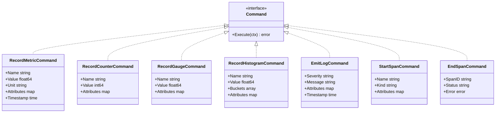

# TelemetryFlow Go SDK - Architecture

This document explains the architectural decisions and patterns used in the TelemetryFlow Go SDK.

## Table of Contents

- [Overview](#overview)
- [High-Level Architecture](#high-level-architecture)
- [Domain-Driven Design (DDD)](#domain-driven-design-ddd)
- [CQRS Pattern](#cqrs-pattern)
- [Layer Architecture](#layer-architecture)
- [Design Principles](#design-principles)
- [Data Flow](#data-flow)
- [Error Handling](#error-handling)
- [Testing Strategy](#testing-strategy)
- [Extension Points](#extension-points)
- [Performance Considerations](#performance-considerations)

## Overview

The TelemetryFlow Go SDK is built using **Domain-Driven Design (DDD)** and **Command Query Responsibility Segregation (CQRS)** patterns. This architecture provides:

- Clear separation of concerns
- Maintainable and testable code
- Easy to extend for new features
- Type-safe with compile-time guarantees
- Production-ready with comprehensive error handling

## High-Level Architecture


## Domain-Driven Design (DDD)

### Bounded Contexts

The SDK has a single bounded context: **Telemetry**


This context contains all domain logic related to:
- Configuration management
- Credential handling
- Signal type definitions (metrics, logs, traces)

### Entities and Value Objects


#### Value Objects (Immutable)

**Credentials** (`domain/credentials.go`)
```go
type Credentials struct {
    keyID     string
    keySecret string
}
```

Value Object characteristics:
- Immutable after creation
- Validates itself on construction
- Equality based on content
- No identity separate from its attributes

**Why Value Object?**
- API credentials are immutable by nature
- Should be validated immediately
- No lifecycle management needed

#### Entities (Mutable)

**TelemetryConfig** (`domain/config.go`)
```go
type TelemetryConfig struct {
    credentials      *Credentials
    endpoint         string
    // ... other configuration
}
```

Entity characteristics:
- Has identity (tied to credentials)
- Can be modified through builder methods
- Represents the aggregate root

**Why Entity?**
- Configuration evolves during setup
- Builder pattern requires mutability
- Acts as aggregate root for telemetry context

### Domain Services

Domain services encapsulate domain logic that doesn't naturally fit into entities or value objects.

The SDK keeps domain services minimal, with most logic in entities and value objects.

## CQRS Pattern


### Why CQRS?

CQRS separates **Commands** (write operations) from **Queries** (read operations).

**Benefits:**
1. **Clear Intent**: Commands express what should happen
2. **Testability**: Commands can be tested in isolation
3. **Extensibility**: New commands don't affect queries
4. **Scalability**: Different optimization strategies for reads/writes

### Command Side

Commands represent intentions to change state:



```go
type RecordMetricCommand struct {
    Name       string
    Value      float64
    Unit       string
    Attributes map[string]interface{}
    Timestamp  time.Time
}

type EmitLogCommand struct {
    Severity   string
    Message    string
    Attributes map[string]interface{}
    Timestamp  time.Time
}

type StartSpanCommand struct {
    Name       string
    Kind       string
    Attributes map[string]interface{}
}
```

**Command Handler:**
```go
type TelemetryCommandHandler struct {
    config         *domain.TelemetryConfig
    tracerProvider *sdktrace.TracerProvider
    meterProvider  *metric.MeterProvider
}

func (h *TelemetryCommandHandler) Handle(ctx context.Context, cmd Command) error {
    // Dispatch to specific handler
}
```

### Query Side

Queries represent requests for data:

```go
type GetMetricQuery struct {
    Name      string
    StartTime time.Time
    EndTime   time.Time
}

type GetLogsQuery struct {
    StartTime  time.Time
    EndTime    time.Time
    Severity   []string
}

type GetTraceQuery struct {
    TraceID string
}
```

**Query Handler:**
```go
type TelemetryQueryHandler struct {
    // HTTP client or gRPC client for TelemetryFlow API
}

func (h *TelemetryQueryHandler) Handle(ctx context.Context, query Query) (interface{}, error) {
    // Fetch and return data
}
```

### Command/Query Buses

The buses route commands and queries to appropriate handlers:

```go
type CommandBus struct {
    handlers map[string]CommandHandler
}

func (b *CommandBus) Register(commandType string, handler CommandHandler) {
    b.handlers[commandType] = handler
}

func (b *CommandBus) Dispatch(ctx context.Context, cmd Command) error {
    // Find and invoke handler
}
```

## Layer Architecture

The SDK follows a clean architecture with four layers:


### 1. Domain Layer (`pkg/telemetryflow/domain/`)

**Responsibility:** Core business logic and rules

**Contains:**
- Entities: `TelemetryConfig`
- Value Objects: `Credentials`, `Protocol`, `SignalType`
- Domain rules and validation

**Dependencies:** None (pure Go)

**Example:**
```go
// Value object with self-validation
func NewCredentials(keyID, keySecret string) (*Credentials, error) {
    if !strings.HasPrefix(keyID, "tfk_") {
        return nil, errors.New("invalid key ID format")
    }
    return &Credentials{keyID, keySecret}, nil
}
```

### 2. Application Layer (`pkg/telemetryflow/application/`)

**Responsibility:** Orchestrate domain objects and implement use cases

**Contains:**
- Commands and Queries (CQRS)
- Command/Query buses
- Application services

**Dependencies:** Domain layer only

**Example:**
```go
// Command represents a use case
type RecordMetricCommand struct {
    Name       string
    Value      float64
    Attributes map[string]interface{}
}
```

### 3. Infrastructure Layer (`pkg/telemetryflow/infrastructure/`)

**Responsibility:** Technical implementation details

**Contains:**
- OTLP exporters (gRPC/HTTP)
- Command handlers
- External integrations (OpenTelemetry SDK)

**Dependencies:** Domain and Application layers

**Example:**
```go
// Infrastructure creates and manages OTLP exporters
type OTLPExporterFactory struct {
    config *domain.TelemetryConfig
}

func (f *OTLPExporterFactory) CreateTraceExporter(ctx context.Context) (sdktrace.SpanExporter, error) {
    // Create gRPC or HTTP exporter based on config
}
```

### 4. Interface Layer (`pkg/telemetryflow/`)

**Responsibility:** Public API that users interact with

**Contains:**
- `Client`: Main SDK client
- `Builder`: Fluent configuration builder
- Public API methods

**Dependencies:** All layers

**Example:**
```go
// Public API
type Client struct {
    config         *domain.TelemetryConfig
    commandHandler *infrastructure.TelemetryCommandHandler
}

func (c *Client) IncrementCounter(ctx context.Context, name string, value int64, attrs map[string]interface{}) error {
    cmd := &application.RecordCounterCommand{Name: name, Value: value}
    return c.commandHandler.Handle(ctx, cmd)
}
```

## Design Principles

### 1. Dependency Inversion

Higher-level modules don't depend on lower-level modules. Both depend on abstractions.

```go
// Bad: Direct dependency on infrastructure
type Client struct {
    grpcExporter *otlptracegrpc.Exporter
}

// Good: Depend on abstraction
type Client struct {
    commandHandler CommandHandler
}
```

### 2. Single Responsibility

Each type has one reason to change.

```go
// Credentials: Only responsible for API key validation
type Credentials struct { /* ... */ }

// TelemetryConfig: Only responsible for configuration
type TelemetryConfig struct { /* ... */ }

// Client: Only responsible for public API
type Client struct { /* ... */ }
```

### 3. Open/Closed Principle

Open for extension, closed for modification.

```go
// Add new commands without modifying existing code
type NewCustomCommand struct {
    // New fields
}

// Register handler
commandBus.Register("new_custom", newCustomHandler)
```

### 4. Interface Segregation

Clients shouldn't depend on interfaces they don't use.

```go
// Separate interfaces for different concerns
type CommandHandler interface {
    Handle(ctx context.Context, cmd Command) error
}

type QueryHandler interface {
    Handle(ctx context.Context, query Query) (interface{}, error)
}
```

### 5. Liskov Substitution

Subtypes must be substitutable for their base types.

```go
// All commands implement Command interface
type Command interface {
    Execute(ctx context.Context) error
}

// Any command can be used where Command is expected
func processCommand(cmd Command) error {
    return cmd.Execute(context.Background())
}
```

## Data Flow

### Write Path (Commands)


### Read Path (Queries)


### Signal-Specific Data Flows

#### Metrics Flow


#### Traces Flow


#### Logs Flow


## Error Handling


### Domain Layer Errors

Return domain-specific errors:

```go
func NewCredentials(keyID, keySecret string) (*Credentials, error) {
    if keyID == "" {
        return nil, errors.New("API key ID cannot be empty")
    }
    // ...
}
```

### Application Layer Errors

Wrap domain errors with context:

```go
func (h *Handler) Handle(ctx context.Context, cmd Command) error {
    if err := validate(cmd); err != nil {
        return fmt.Errorf("command validation failed: %w", err)
    }
    // ...
}
```

### Infrastructure Layer Errors

Handle technical errors gracefully:

```go
func (f *Factory) CreateExporter(ctx context.Context) (Exporter, error) {
    exporter, err := otlpgrpc.New(ctx, options...)
    if err != nil {
        return nil, fmt.Errorf("failed to create OTLP exporter: %w", err)
    }
    return exporter, nil
}
```

## Testing Strategy


### Unit Tests

Test each layer independently:

```go
// Domain layer tests
func TestCredentials_Validation(t *testing.T) {
    _, err := domain.NewCredentials("invalid", "secret")
    assert.Error(t, err)
}

// Application layer tests
func TestCommandHandler_RecordMetric(t *testing.T) {
    handler := NewMockHandler()
    cmd := &RecordMetricCommand{Name: "test"}
    err := handler.Handle(context.Background(), cmd)
    assert.NoError(t, err)
}
```

### Integration Tests

Test interactions between layers:

```go
func TestClient_EndToEnd(t *testing.T) {
    client := setupTestClient()
    err := client.IncrementCounter(ctx, "test", 1, nil)
    assert.NoError(t, err)
}
```

## Extension Points


### Adding New Commands

1. Define command in `application/commands.go`:
```go
type NewFeatureCommand struct {
    Field1 string
    Field2 int
}
```

2. Add handler in infrastructure layer
3. Wire up in `Client` public API

### Adding New Signal Types

1. Add constant in `domain/config.go`:
```go
const SignalEvents SignalType = "events"
```

2. Add configuration support
3. Implement command handlers
4. Expose in public API

## Performance Considerations


### Batching

Commands are batched by OpenTelemetry SDK:

```go
config.WithBatchSettings(
    10 * time.Second,  // batch timeout
    512,               // max batch size
)
```

### Concurrency

The SDK is thread-safe:

```go
var wg sync.WaitGroup
for i := 0; i < 100; i++ {
    wg.Add(1)
    go func() {
        defer wg.Done()
        client.IncrementCounter(ctx, "concurrent", 1, nil)
    }()
}
wg.Wait()
```

### Memory Management

- Credentials are immutable (no copying)
- Commands are short-lived
- Exporters reuse connections

## Conclusion


The TelemetryFlow Go SDK's architecture provides:

| Feature              | Description                                                    |
| -------------------- | -------------------------------------------------------------- |
| **Maintainability**  | Clear layer separation with single responsibility              |
| **Testability**      | Easy to mock and test each layer independently                 |
| **Extensibility**    | Simple to add new commands, signals, and protocols             |
| **Performance**      | Efficient batching, connection pooling, and concurrency        |
| **Type Safety**      | Compile-time guarantees with strong Go typing                  |
| **Production Ready** | Comprehensive error handling, retries, and graceful shutdown   |

This architecture serves as both a fully functional SDK and a reference implementation for applying DDD and CQRS patterns in Go.

---

## Quick Reference

### SDK Initialization Flow


### Shutdown Flow


