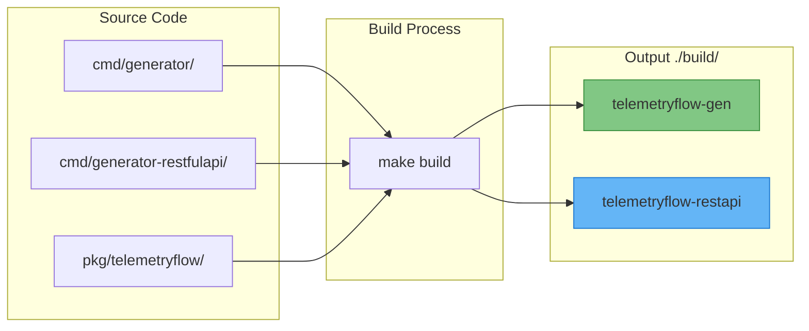
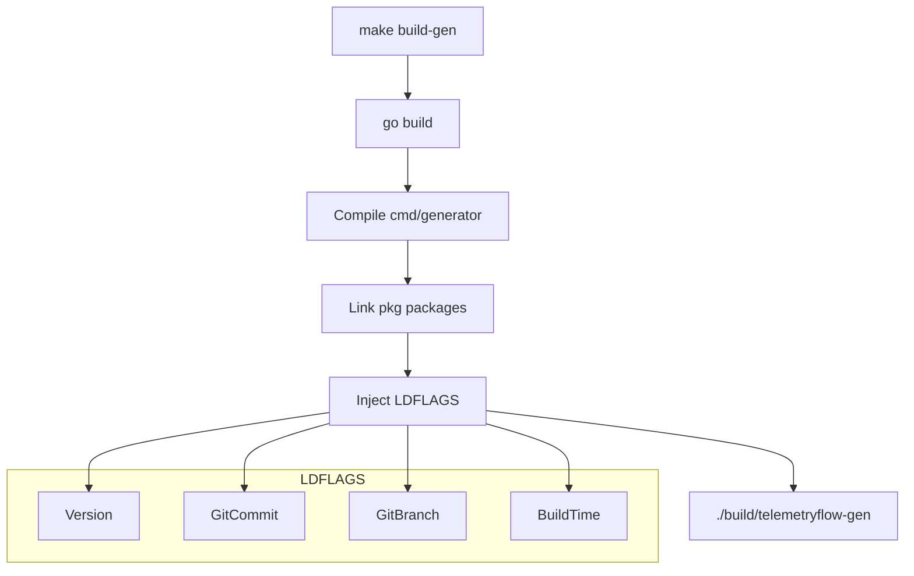
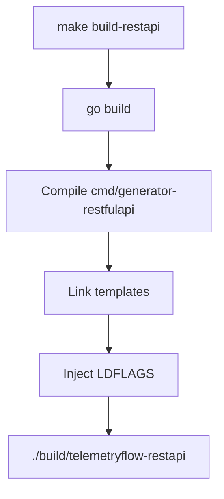

# TelemetryFlow Go SDK Build System

- **Version:** 1.1.1
- **Go Version:** 1.24+
- **Last Updated:** December 2025

---

## Overview

TelemetryFlow Go SDK uses a Makefile-based build system that produces multiple binaries:

1. **`telemetryflow-gen`** - SDK integration code generator
2. **`telemetryflow-restapi`** - DDD + CQRS RESTful API generator



---

## Build Comparison

| Aspect | `telemetryflow-gen` | `telemetryflow-restapi` |
|--------|---------------------|-------------------------|
| **Source** | `cmd/generator/` | `cmd/generator-restfulapi/` |
| **Purpose** | SDK integration | Full API project generation |
| **Commands** | `init`, `example`, `config`, `version` | `new`, `entity`, `docs`, `version` |
| **Output** | `telemetry/` directory | Complete DDD project |
| **Binary Location** | `./build/telemetryflow-gen` | `./build/telemetryflow-restapi` |

---

## SDK Generator Build

### Build Process



### Build Command

```bash
# Build SDK generator
make build-gen

# Output
./build/telemetryflow-gen
```

### CLI Commands

```bash
# Show help
./build/telemetryflow-gen --help

# Initialize integration
./build/telemetryflow-gen init --project myapp --service my-service

# Generate examples
./build/telemetryflow-gen example http-server

# Show version
./build/telemetryflow-gen version
```

---

## RESTful API Generator Build

### Build Process



### Build Command

```bash
# Build RESTful API generator
make build-restapi

# Output
./build/telemetryflow-restapi
```

### CLI Commands

```bash
# Show help
./build/telemetryflow-restapi --help

# Create new project
./build/telemetryflow-restapi new --name order-service --module github.com/org/order-service

# Add entity
./build/telemetryflow-restapi entity --name Order --fields 'customer_id:uuid,total:decimal'

# Regenerate docs
./build/telemetryflow-restapi docs

# Show version
./build/telemetryflow-restapi version
```

---

## Directory Structure

```text
telemetryflow-go-sdk/
├── cmd/
│   ├── generator/                  # SDK generator entry point
│   │   └── main.go
│   └── generator-restfulapi/       # RESTful API generator entry point
│       ├── main.go
│       └── templates/              # Generation templates
│           ├── project/
│           ├── entity/
│           └── config/
├── pkg/telemetryflow/              # Main SDK package
│   ├── domain/
│   ├── application/
│   └── infrastructure/
├── internal/
│   ├── version/                    # Version info
│   └── banner/                     # ASCII banner
├── build/                          # Build output
│   ├── telemetryflow-gen
│   └── telemetryflow-restapi
├── tests/
│   ├── unit/
│   ├── integration/
│   └── e2e/
├── configs/                        # Configuration examples
├── docs/                           # Documentation
├── Makefile
└── go.mod
```

---

## Makefile Reference

### Variables

```makefile
PRODUCT_NAME := TelemetryFlow Go SDK
VERSION ?= 1.1.1
GO_VERSION := 1.24

BUILD_DIR := ./build
CMD_GEN := ./cmd/generator
CMD_RESTAPI := ./cmd/generator-restfulapi

BINARY_GEN := telemetryflow-gen
BINARY_RESTAPI := telemetryflow-restapi
```

### LDFLAGS

Version information is injected at build time:

```makefile
LDFLAGS := -s -w \
    -X 'github.com/telemetryflow/telemetryflow-go-sdk/internal/version.Version=$(VERSION)' \
    -X 'github.com/telemetryflow/telemetryflow-go-sdk/internal/version.GitCommit=$(GIT_COMMIT)' \
    -X 'github.com/telemetryflow/telemetryflow-go-sdk/internal/version.GitBranch=$(GIT_BRANCH)' \
    -X 'github.com/telemetryflow/telemetryflow-go-sdk/internal/version.BuildTime=$(BUILD_TIME)'
```

### Build Targets

```makefile
# Default target
all: build

# Build all binaries
build: build-gen build-restapi

# Build SDK generator
build-gen:
    go build -ldflags "$(LDFLAGS)" -o $(BUILD_DIR)/$(BINARY_GEN) $(CMD_GEN)

# Build RESTful API generator
build-restapi:
    go build -ldflags "$(LDFLAGS)" -o $(BUILD_DIR)/$(BINARY_RESTAPI) $(CMD_RESTAPI)

# Cross-compile for all platforms
build-all: build-linux build-darwin build-windows

build-linux:
    GOOS=linux GOARCH=amd64 go build -ldflags "$(LDFLAGS)" -o $(BUILD_DIR)/$(BINARY_GEN)-linux-amd64 $(CMD_GEN)
    GOOS=linux GOARCH=arm64 go build -ldflags "$(LDFLAGS)" -o $(BUILD_DIR)/$(BINARY_GEN)-linux-arm64 $(CMD_GEN)

build-darwin:
    GOOS=darwin GOARCH=amd64 go build -ldflags "$(LDFLAGS)" -o $(BUILD_DIR)/$(BINARY_GEN)-darwin-amd64 $(CMD_GEN)
    GOOS=darwin GOARCH=arm64 go build -ldflags "$(LDFLAGS)" -o $(BUILD_DIR)/$(BINARY_GEN)-darwin-arm64 $(CMD_GEN)

build-windows:
    GOOS=windows GOARCH=amd64 go build -ldflags "$(LDFLAGS)" -o $(BUILD_DIR)/$(BINARY_GEN)-windows-amd64.exe $(CMD_GEN)
```

### Test Targets

```makefile
# Run all tests
test:
    go test -v ./...

# Run unit tests
test-unit:
    go test -v ./tests/unit/...

# Run integration tests
test-integration:
    go test -v ./tests/integration/...

# Run e2e tests
test-e2e:
    TELEMETRYFLOW_E2E=true go test -v -timeout 5m ./tests/e2e/...

# Run tests with coverage
test-coverage:
    go test -coverprofile=coverage.out ./...
    go tool cover -html=coverage.out -o coverage.html

# Run tests with race detection
test-race:
    go test -race ./...
```

### Lint Targets

```makefile
# Run linters
lint:
    golangci-lint run ./...

# Fix lint issues
lint-fix:
    golangci-lint run --fix ./...

# Run staticcheck
staticcheck:
    staticcheck ./...
```

### Common Targets

```makefile
# Clean build artifacts
clean:
    rm -rf $(BUILD_DIR)/*
    rm -f coverage.out coverage.html

# Tidy go modules
tidy:
    go mod tidy

# Download dependencies
deps:
    go mod download

# Show version info
version:
    @echo "Version: $(VERSION)"
    @echo "Go Version: $(GO_VERSION)"
    @echo "Git Commit: $(GIT_COMMIT)"

# Show help
help:
    @echo "Available targets:"
    @echo "  build        - Build all binaries"
    @echo "  build-gen    - Build SDK generator"
    @echo "  build-restapi - Build RESTful API generator"
    @echo "  test         - Run all tests"
    @echo "  test-unit    - Run unit tests"
    @echo "  lint         - Run linters"
    @echo "  clean        - Clean build artifacts"
    @echo "  tidy         - Tidy go modules"
    @echo "  help         - Show this help"
```

---

## Docker Build

### Dockerfile

```dockerfile
# Build stage
FROM golang:1.24-alpine AS builder

WORKDIR /app
COPY go.mod go.sum ./
RUN go mod download

COPY . .

ARG VERSION=dev
ARG GIT_COMMIT=unknown
ARG BUILD_TIME=unknown

RUN CGO_ENABLED=0 GOOS=linux go build \
    -ldflags "-s -w \
    -X 'github.com/telemetryflow/telemetryflow-go-sdk/internal/version.Version=${VERSION}' \
    -X 'github.com/telemetryflow/telemetryflow-go-sdk/internal/version.GitCommit=${GIT_COMMIT}' \
    -X 'github.com/telemetryflow/telemetryflow-go-sdk/internal/version.BuildTime=${BUILD_TIME}'" \
    -o /build/telemetryflow-gen ./cmd/generator

# Runtime stage
FROM alpine:3.21

RUN apk --no-cache add ca-certificates

COPY --from=builder /build/telemetryflow-gen /usr/local/bin/

WORKDIR /workspace
ENTRYPOINT ["telemetryflow-gen"]
```

### Build Docker Image

```bash
# Build image
docker build \
    --build-arg VERSION=$(cat VERSION) \
    --build-arg GIT_COMMIT=$(git rev-parse --short HEAD) \
    --build-arg BUILD_TIME=$(date -u '+%Y-%m-%dT%H:%M:%SZ') \
    -t telemetryflow/telemetryflow-sdk:latest .

# Run container
docker run --rm -v $(pwd):/workspace telemetryflow/telemetryflow-sdk:latest \
    init --project myapp --output /workspace
```

---

## Installation

### From Source

```bash
# Clone repository
git clone https://github.com/telemetryflow/telemetryflow-go-sdk.git
cd telemetryflow-go-sdk

# Build
make build

# Install to GOPATH/bin
go install ./cmd/generator@latest
go install ./cmd/generator-restfulapi@latest
```

### From Go Install

```bash
# Install SDK generator
go install github.com/telemetryflow/telemetryflow-go-sdk/cmd/generator@latest

# Install RESTful API generator
go install github.com/telemetryflow/telemetryflow-go-sdk/cmd/generator-restfulapi@latest
```

---

## Troubleshooting

### Build Fails: "go: version mismatch"

Ensure you have Go 1.24+ installed:

```bash
go version
# Expected: go version go1.24.x ...

# Or use GVM
gvm use go1.24.11
```

### LDFLAGS Not Working

Make sure variables are set:

```bash
# Check git info
git rev-parse --short HEAD
git rev-parse --abbrev-ref HEAD

# Build with explicit values
make build VERSION=1.1.1
```

### Cross-Compile Errors

Install cross-compile toolchain:

```bash
# For CGO-enabled builds
brew install FiloSottile/musl-cross/musl-cross
```

---

**Copyright (c) 2024-2026 DevOpsCorner Indonesia. All rights reserved.**
