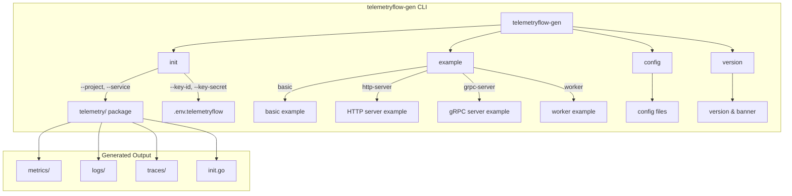
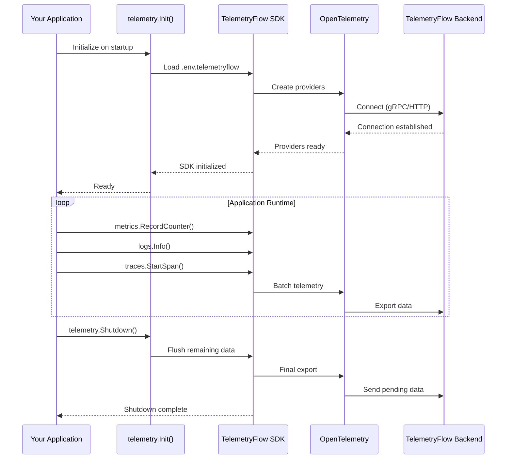

# TelemetryFlow Code Generator

## Overview

`telemetryflow-gen` is a command-line tool that generates boilerplate code for integrating TelemetryFlow into your Go applications. It creates a complete telemetry package with metrics, logs, and traces support.

## Command Flow



## Installation

### From Binary Release

Download the latest release for your platform:

```bash
# Linux (amd64)
curl -LO https://github.com/telemetryflow/telemetryflow-go-sdk/releases/latest/download/telemetryflow-sdk-linux-amd64.tar.gz
tar -xzf telemetryflow-sdk-linux-amd64.tar.gz
sudo mv telemetryflow-gen /usr/local/bin/

# macOS (Apple Silicon)
curl -LO https://github.com/telemetryflow/telemetryflow-go-sdk/releases/latest/download/telemetryflow-sdk-darwin-arm64.tar.gz
tar -xzf telemetryflow-sdk-darwin-arm64.tar.gz
sudo mv telemetryflow-gen /usr/local/bin/

# macOS (Intel)
curl -LO https://github.com/telemetryflow/telemetryflow-go-sdk/releases/latest/download/telemetryflow-sdk-darwin-amd64.tar.gz
tar -xzf telemetryflow-sdk-darwin-amd64.tar.gz
sudo mv telemetryflow-gen /usr/local/bin/
```

### From Source

```bash
go install github.com/telemetryflow/telemetryflow-go-sdk/cmd/generator@latest
```

### Using Docker

```bash
docker run --rm -v $(pwd):/workspace telemetryflow/telemetryflow-sdk:latest --help
```

## Commands

### `init` - Initialize TelemetryFlow Integration

Creates a complete telemetry package in your project.

```bash
telemetryflow-gen init --project myapp --service my-service
```

**Flags:**

| Flag | Short | Description | Default |
|------|-------|-------------|---------|
| `--project` | `-p` | Project name (required) | - |
| `--service` | `-n` | Service name | Project name |
| `--key-id` | `-k` | TelemetryFlow API Key ID | - |
| `--key-secret` | `-s` | TelemetryFlow API Key Secret | - |
| `--endpoint` | `-e` | OTLP endpoint | `api.telemetryflow.id:4317` |
| `--metrics` | - | Enable metrics | `true` |
| `--logs` | - | Enable logs | `true` |
| `--traces` | - | Enable traces | `true` |
| `--output` | `-o` | Output directory | `.` |

**Example:**

```bash
telemetryflow-gen init \
  --project myapp \
  --service my-api-service \
  --key-id your-key-id \
  --key-secret your-key-secret \
  --endpoint api.telemetryflow.id:4317
```

### `example` - Generate Example Code

Generates example code for specific use cases.

```bash
telemetryflow-gen example [type]
```

**Available Types:**

| Type | Description |
|------|-------------|
| `basic` | Basic telemetry usage example |
| `http-server` | HTTP server with telemetry middleware |
| `grpc-server` | gRPC server with telemetry interceptors |
| `worker` | Background worker with telemetry |

**Example:**

```bash
telemetryflow-gen example http-server --output ./examples
```

### `config` - Generate Configuration

Generates a configuration file for TelemetryFlow.

```bash
telemetryflow-gen config \
  --service my-service \
  --key-id your-key-id \
  --key-secret your-key-secret
```

### `version` - Show Version

Displays version information and banner.

```bash
telemetryflow-gen version
```

## Generated File Structure

After running `init`, the following structure is created:

```
your-project/
├── telemetry/
│   ├── init.go           # Telemetry initialization
│   ├── README.md         # Usage documentation
│   ├── metrics/
│   │   └── metrics.go    # Metrics helpers
│   ├── logs/
│   │   └── logs.go       # Logging helpers
│   └── traces/
│       └── traces.go     # Tracing helpers
└── .env.telemetryflow    # Configuration file
```

## Telemetry Integration Flow



## Usage in Your Application

### 1. Initialize Telemetry

```go
package main

import (
    "your-module/telemetry"
)

func main() {
    // Initialize telemetry (reads from .env.telemetryflow or environment)
    if err := telemetry.Init(); err != nil {
        log.Fatal(err)
    }
    defer telemetry.Shutdown()

    // Your application code...
}
```

### 2. Use Metrics

```go
import "your-module/telemetry/metrics"

func handleRequest() {
    // Record counter
    metrics.RecordCounter("requests_total", 1, map[string]string{
        "method": "GET",
        "path":   "/api/users",
    })

    // Record histogram
    metrics.RecordHistogram("request_duration_ms", 42.5, map[string]string{
        "endpoint": "/api/users",
    })
}
```

### 3. Use Logging

```go
import "your-module/telemetry/logs"

func processOrder(orderID string) {
    logs.Info("Processing order", map[string]interface{}{
        "order_id": orderID,
        "status":   "pending",
    })

    logs.Error("Order failed", map[string]interface{}{
        "order_id": orderID,
        "error":    "insufficient stock",
    })
}
```

### 4. Use Tracing

```go
import "your-module/telemetry/traces"

func handleRequest(ctx context.Context) {
    ctx, span := traces.StartSpan(ctx, "handleRequest")
    defer span.End()

    span.SetAttributes(map[string]string{
        "user.id":  "12345",
        "request.path": "/api/users",
    })

    // Call other services
    callExternalService(ctx)
}
```

## Configuration

### Environment Variables

| Variable | Description | Default |
|----------|-------------|---------|
| `TELEMETRYFLOW_API_KEY_ID` | API Key ID | - |
| `TELEMETRYFLOW_API_KEY_SECRET` | API Key Secret | - |
| `TELEMETRYFLOW_ENDPOINT` | OTLP endpoint | `api.telemetryflow.id:4317` |
| `TELEMETRYFLOW_SERVICE_NAME` | Service name | - |
| `TELEMETRYFLOW_ENVIRONMENT` | Environment | `production` |
| `TELEMETRYFLOW_ENABLE_METRICS` | Enable metrics | `true` |
| `TELEMETRYFLOW_ENABLE_LOGS` | Enable logs | `true` |
| `TELEMETRYFLOW_ENABLE_TRACES` | Enable traces | `true` |

### Configuration File (.env.telemetryflow)

```bash
# TelemetryFlow Configuration
TELEMETRYFLOW_API_KEY_ID=your-key-id
TELEMETRYFLOW_API_KEY_SECRET=your-key-secret
TELEMETRYFLOW_ENDPOINT=api.telemetryflow.id:4317
TELEMETRYFLOW_SERVICE_NAME=my-service
TELEMETRYFLOW_ENVIRONMENT=production
TELEMETRYFLOW_ENABLE_METRICS=true
TELEMETRYFLOW_ENABLE_LOGS=true
TELEMETRYFLOW_ENABLE_TRACES=true
```

## Custom Templates

You can use custom templates by specifying the `--template-dir` flag:

```bash
telemetryflow-gen init \
  --project myapp \
  --template-dir ./my-templates
```

### Template Files

Templates use Go's `text/template` syntax. Available template data:

```go
type TemplateData struct {
    ProjectName   string
    ModulePath    string
    ServiceName   string
    Environment   string
    EnableMetrics bool
    EnableLogs    bool
    EnableTraces  bool
    APIKeyID      string
    APIKeySecret  string
    Endpoint      string
    Port          string
    NumWorkers    int
    QueueSize     int
}
```

## Global Flags

| Flag | Description |
|------|-------------|
| `--template-dir` | Custom template directory |
| `--no-banner` | Disable banner output |
| `--help` | Show help |

## Examples

### Basic Project Setup

```bash
# Create new project
mkdir my-microservice && cd my-microservice
go mod init github.com/myorg/my-microservice

# Initialize TelemetryFlow
telemetryflow-gen init \
  --project my-microservice \
  --service my-microservice-api \
  --key-id $TELEMETRYFLOW_API_KEY_ID \
  --key-secret $TELEMETRYFLOW_API_KEY_SECRET

# Generate HTTP server example
telemetryflow-gen example http-server

# Run the example
go run example_http_server.go
```

### Docker Integration

```bash
# Generate with Docker
docker run --rm \
  -v $(pwd):/workspace \
  telemetryflow/telemetryflow-sdk:latest \
  init --project myapp --output /workspace
```

## See Also

- [RESTful API Generator](GENERATOR_RESTAPI.md) - Generate DDD + CQRS RESTful APIs
- [Architecture](ARCHITECTURE.md) - SDK architecture overview
- [Quick Start](QUICKSTART.md) - Getting started guide
- [API Reference](API_REFERENCE.md) - Complete API documentation
