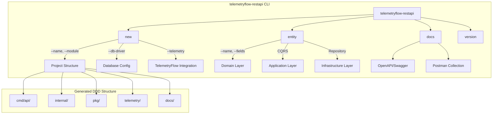
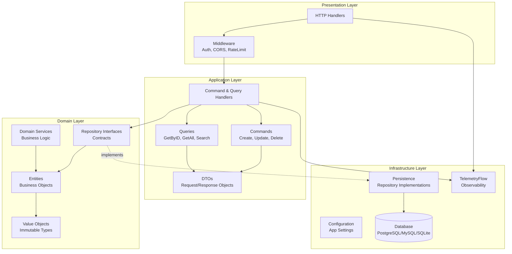
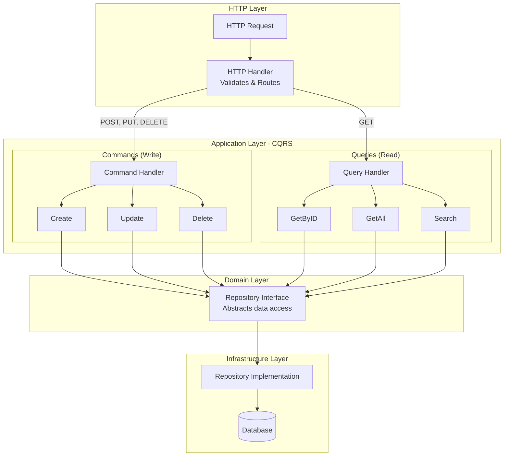

# TelemetryFlow RESTful API Generator

## Overview

`telemetryflow-restapi` is a command-line tool that generates complete DDD (Domain-Driven Design) + CQRS (Command Query Responsibility Segregation) RESTful API projects. It creates production-ready Go applications with Echo web framework, full observability integration, and comprehensive documentation.

## Generator Command Flow



## Features

- **DDD Architecture**: Domain-driven design with clear separation of concerns
- **CQRS Pattern**: Separate command and query models for scalability
- **Echo Framework**: High-performance web framework with middleware support
- **Full CRUD Operations**: Complete Create, Read, Update, Delete endpoints
- **OpenAPI/Swagger**: Auto-generated API documentation
- **Postman Collections**: BDD-style test collections
- **ERD & DFD Diagrams**: Entity Relationship and Data Flow diagrams
- **TelemetryFlow Integration**: Built-in observability with metrics, logs, and traces
- **Database Support**: PostgreSQL, MySQL, and SQLite
- **Authentication**: JWT-based authentication middleware
- **Rate Limiting**: Configurable rate limiting middleware
- **CORS**: Cross-Origin Resource Sharing support

## Installation

### From Binary Release

Download the latest release for your platform:

```bash
# Linux (amd64)
curl -LO https://github.com/telemetryflow/telemetryflow-go-sdk/releases/latest/download/telemetryflow-sdk-linux-amd64.tar.gz
tar -xzf telemetryflow-sdk-linux-amd64.tar.gz
sudo mv telemetryflow-restapi /usr/local/bin/

# macOS (Apple Silicon)
curl -LO https://github.com/telemetryflow/telemetryflow-go-sdk/releases/latest/download/telemetryflow-sdk-darwin-arm64.tar.gz
tar -xzf telemetryflow-sdk-darwin-arm64.tar.gz
sudo mv telemetryflow-restapi /usr/local/bin/

# macOS (Intel)
curl -LO https://github.com/telemetryflow/telemetryflow-go-sdk/releases/latest/download/telemetryflow-sdk-darwin-amd64.tar.gz
tar -xzf telemetryflow-sdk-darwin-amd64.tar.gz
sudo mv telemetryflow-restapi /usr/local/bin/
```

### From Source

```bash
go install github.com/telemetryflow/telemetryflow-go-sdk/cmd/generator-restfulapi@latest
```

### Using Docker

```bash
docker run --rm -v $(pwd):/workspace telemetryflow/telemetryflow-sdk:latest \
  telemetryflow-restapi --help
```

## Commands

### `new` - Create New Project

Creates a complete DDD + CQRS RESTful API project structure.

```bash
telemetryflow-restapi new --name my-api
```

**Flags:**

| Flag | Short | Description | Default |
|------|-------|-------------|---------|
| `--name` | `-n` | Project name (required) | - |
| `--module` | `-m` | Go module path | `github.com/example/<name>` |
| `--service` | - | Service name | Project name |
| `--version` | - | Service version | `1.0.0` |
| `--env` | - | Environment | `development` |
| `--db-driver` | - | Database driver | `postgres` |
| `--db-host` | - | Database host | `localhost` |
| `--db-port` | - | Database port | `5432` |
| `--db-name` | - | Database name | Project name |
| `--db-user` | - | Database user | `postgres` |
| `--port` | - | Server port | `8080` |
| `--telemetry` | - | Enable TelemetryFlow | `true` |
| `--swagger` | - | Enable Swagger docs | `true` |
| `--cors` | - | Enable CORS middleware | `true` |
| `--auth` | - | Enable JWT auth | `true` |
| `--rate-limit` | - | Enable rate limiting | `true` |
| `--output` | `-o` | Output directory | `.` |

**Example:**

```bash
telemetryflow-restapi new \
  --name user-service \
  --module github.com/myorg/user-service \
  --service user-api \
  --db-driver postgres \
  --db-host db.example.com \
  --db-port 5432 \
  --db-name users \
  --port 8080 \
  --telemetry \
  --swagger \
  --auth
```

### `entity` - Add New Entity

Generates a complete entity with domain model, repository, CQRS handlers, and HTTP endpoints.

```bash
telemetryflow-restapi entity --name User --fields 'name:string,email:string,age:int'
```

**Flags:**

| Flag | Short | Description | Default |
|------|-------|-------------|---------|
| `--name` | `-n` | Entity name (required) | - |
| `--fields` | `-f` | Entity fields definition | - |
| `--output` | `-o` | Project root directory | `.` |

**Field Types:**

| Type | Go Type | Database Type |
|------|---------|---------------|
| `string`, `text` | `string` | `VARCHAR`/`TEXT` |
| `int`, `integer` | `int` | `INTEGER` |
| `int64`, `bigint` | `int64` | `BIGINT` |
| `float`, `float64`, `decimal` | `float64` | `DECIMAL` |
| `bool`, `boolean` | `bool` | `BOOLEAN` |
| `time`, `datetime`, `timestamp` | `time.Time` | `TIMESTAMP` |
| `uuid` | `uuid.UUID` | `UUID` |

**Nullable Fields:**

Add `?` suffix to make a field nullable:

```bash
--fields 'name:string,bio:text?,age:int?'
```

**Example:**

```bash
telemetryflow-restapi entity \
  --name Product \
  --fields 'name:string,description:text?,price:decimal,stock:int,active:bool' \
  --output ./my-api
```

### `docs` - Generate Documentation

Regenerates API documentation files.

```bash
telemetryflow-restapi docs --output ./my-api
```

**Flags:**

| Flag | Short | Description | Default |
|------|-------|-------------|---------|
| `--output` | `-o` | Project root directory | `.` |

### `version` - Show Version

Displays version information and banner.

```bash
telemetryflow-restapi version
```

## Generated Project Structure

After running `new`, the following structure is created:

```
my-api/
├── cmd/
│   └── api/
│       └── main.go                    # Application entry point
├── internal/
│   ├── domain/                        # Domain Layer (DDD)
│   │   ├── entity/
│   │   │   └── base.go                # Base entity with common fields
│   │   ├── repository/
│   │   │   └── base.go                # Repository interface
│   │   └── valueobject/               # Value objects
│   ├── application/                   # Application Layer (CQRS)
│   │   ├── command/
│   │   │   └── base.go                # Base command definitions
│   │   ├── query/
│   │   │   └── base.go                # Base query definitions
│   │   ├── handler/
│   │   │   └── base.go                # Base handler
│   │   └── dto/
│   │       └── base.go                # Data Transfer Objects
│   └── infrastructure/                # Infrastructure Layer
│       ├── config/
│       │   └── config.go              # Configuration management
│       ├── http/
│       │   ├── server.go              # HTTP server setup
│       │   ├── router.go              # Route definitions
│       │   ├── middleware/
│       │   │   ├── auth.go            # JWT authentication
│       │   │   ├── cors.go            # CORS handling
│       │   │   ├── logger.go          # Request logging
│       │   │   └── ratelimit.go       # Rate limiting
│       │   └── handler/
│       │       └── health.go          # Health check endpoint
│       └── persistence/
│           └── database.go            # Database connection
├── pkg/
│   ├── logger/
│   │   └── logger.go                  # Structured logging
│   ├── validator/
│   │   └── validator.go               # Request validation
│   └── response/
│       └── response.go                # HTTP response helpers
├── telemetry/                         # TelemetryFlow integration
│   ├── init.go                        # Telemetry initialization
│   ├── metrics/
│   │   └── metrics.go                 # Custom metrics
│   ├── logs/
│   │   └── logs.go                    # Structured logs
│   └── traces/
│       └── traces.go                  # Distributed traces
├── docs/
│   ├── api/
│   │   ├── openapi.yaml               # OpenAPI 3.0 specification
│   │   └── swagger.json               # Swagger 2.0 specification
│   ├── diagrams/
│   │   ├── ERD.md                     # Entity Relationship Diagram
│   │   └── DFD.md                     # Data Flow Diagram
│   └── postman/
│       ├── collection.json            # Postman collection
│       └── environment.json           # Postman environment
├── configs/
│   └── config.yaml                    # Application configuration
├── migrations/
│   ├── 000001_init.up.sql             # Initial migration (up)
│   └── 000001_init.down.sql           # Initial migration (down)
├── scripts/
│   ├── run.sh                         # Run script
│   └── test.sh                        # Test script
├── tests/
│   ├── unit/                          # Unit tests
│   ├── integration/                   # Integration tests
│   ├── e2e/                           # End-to-end tests
│   ├── mocks/                         # Mock implementations
│   └── fixtures/                      # Test fixtures
├── .env.example                       # Environment variables template
├── .gitignore                         # Git ignore file
├── Dockerfile                         # Docker build file
├── docker-compose.yml                 # Docker Compose configuration
├── Makefile                           # Build and task automation
├── go.mod                             # Go module file
└── README.md                          # Project documentation
```

## Entity Generation Structure

After running `entity`, the following files are generated:

```
my-api/
├── internal/
│   ├── domain/
│   │   ├── entity/
│   │   │   └── user.go                  # Entity definition
│   │   └── repository/
│   │       └── user_repository.go       # Repository interface
│   ├── application/
│   │   ├── command/
│   │   │   └── user_commands.go         # Create, Update, Delete commands
│   │   ├── query/
│   │   │   └── user_queries.go          # GetByID, GetAll, Search queries
│   │   ├── handler/
│   │   │   ├── user_command_handler.go  # Command handlers
│   │   │   └── user_query_handler.go    # Query handlers
│   │   └── dto/
│   │       └── user_dto.go              # Request/Response DTOs
│   └── infrastructure/
│       ├── persistence/
│       │   └── user_repository.go       # Repository implementation
│       └── http/
│           └── handler/
│               └── user_handler.go      # HTTP handlers
└── migrations/
    ├── 000002_create_users.up.sql       # Entity migration (up)
    └── 000002_create_users.down.sql     # Entity migration (down)
```

## Architecture

### DDD Layers



1. **Domain Layer** (`internal/domain/`)
   - Contains business logic and domain models
   - Entities, Value Objects, Domain Services
   - Repository interfaces (not implementations)

2. **Application Layer** (`internal/application/`)
   - Orchestrates use cases using CQRS pattern
   - Commands: Write operations (Create, Update, Delete)
   - Queries: Read operations (GetByID, List, Search)
   - DTOs for data transfer

3. **Infrastructure Layer** (`internal/infrastructure/`)
   - External concerns: HTTP, Database, Config
   - Repository implementations
   - Middleware and handlers

### CQRS Pattern



## Configuration

### Environment Variables

| Variable | Description | Default |
|----------|-------------|---------|
| `APP_NAME` | Application name | Project name |
| `APP_ENV` | Environment | `development` |
| `APP_PORT` | Server port | `8080` |
| `DB_DRIVER` | Database driver | `postgres` |
| `DB_HOST` | Database host | `localhost` |
| `DB_PORT` | Database port | `5432` |
| `DB_NAME` | Database name | Project name |
| `DB_USER` | Database user | `postgres` |
| `DB_PASSWORD` | Database password | - |
| `DB_SSL_MODE` | SSL mode | `disable` |
| `JWT_SECRET` | JWT signing secret | - |
| `JWT_EXPIRY` | JWT expiry duration | `24h` |
| `RATE_LIMIT` | Requests per minute | `100` |
| `TELEMETRYFLOW_API_KEY_ID` | TelemetryFlow API Key | - |
| `TELEMETRYFLOW_API_KEY_SECRET` | TelemetryFlow Secret | - |
| `TELEMETRYFLOW_ENDPOINT` | OTLP endpoint | `api.telemetryflow.id:4317` |

### Configuration File (config.yaml)

```yaml
app:
  name: my-api
  env: development
  port: 8080

database:
  driver: postgres
  host: localhost
  port: 5432
  name: my_api
  user: postgres
  password: ""
  sslMode: disable

server:
  readTimeout: 30s
  writeTimeout: 30s
  idleTimeout: 60s

auth:
  jwtSecret: your-secret-key
  jwtExpiry: 24h

rateLimit:
  requests: 100
  window: 1m

telemetry:
  enabled: true
  endpoint: api.telemetryflow.id:4317
```

## Template Functions

Templates support the following helper functions:

| Function | Description | Example |
|----------|-------------|---------|
| `lower` | Convert to lowercase | `{{lower .Name}}` → `user` |
| `upper` | Convert to uppercase | `{{upper .Name}}` → `USER` |
| `title` | Convert to title case | `{{title .Name}}` → `User` |
| `pascal` | Convert to PascalCase | `{{pascal "user_name"}}` → `UserName` |
| `camel` | Convert to camelCase | `{{camel "user_name"}}` → `userName` |
| `snake` | Convert to snake_case | `{{snake "UserName"}}` → `user_name` |
| `plural` | Pluralize word | `{{plural "user"}}` → `users` |
| `contains` | Check substring | `{{contains .Name "user"}}` |
| `replace` | Replace string | `{{replace .Name "-" "_"}}` |
| `trimSuffix` | Trim suffix | `{{trimSuffix .Name "_id"}}` |
| `trimPrefix` | Trim prefix | `{{trimPrefix .Name "tbl_"}}` |
| `add` | Add numbers | `{{add 1 2}}` → `3` |

## Custom Templates

You can use custom templates by specifying the `--template-dir` flag:

```bash
telemetryflow-restapi new \
  --name my-api \
  --template-dir ./my-templates
```

### Template Data

Templates receive the following data structure:

```go
type TemplateData struct {
    // Project info
    ProjectName    string
    ModulePath     string
    ServiceName    string
    ServiceVersion string
    Environment    string
    EnvPrefix      string  // Environment variable prefix (e.g., ORDER_SERVICE)

    // Database
    DBDriver string
    DBHost   string
    DBPort   string
    DBName   string
    DBUser   string

    // Server
    ServerPort string

    // Features
    EnableTelemetry bool
    EnableSwagger   bool
    EnableCORS      bool
    EnableAuth      bool
    EnableRateLimit bool

    // Entity (for entity generation)
    EntityName       string
    EntityNameLower  string
    EntityNamePlural string
    EntityFields     []EntityField
}

type EntityField struct {
    Name     string  // PascalCase name
    Type     string  // Original type
    JSONName string  // camelCase for JSON
    DBColumn string  // snake_case for database
    GoType   string  // Go type
    Nullable bool    // Is nullable
}
```

## Global Flags

| Flag | Description |
|------|-------------|
| `--template-dir` | Custom template directory |
| `--no-banner` | Disable banner output |
| `--help` | Show help |

## Examples

### Complete Microservice

```bash
# Create project
telemetryflow-restapi new \
  --name order-service \
  --module github.com/myorg/order-service \
  --service order-api \
  --db-driver postgres \
  --db-host localhost \
  --db-port 5432 \
  --db-name orders \
  --port 8080

# Navigate to project
cd order-service

# Add entities
telemetryflow-restapi entity \
  --name Order \
  --fields 'customer_id:uuid,total:decimal,status:string,created_at:timestamp'

telemetryflow-restapi entity \
  --name OrderItem \
  --fields 'order_id:uuid,product_id:uuid,quantity:int,price:decimal'

# Setup and run
cp .env.example .env
go mod tidy
make run
```

### Docker Deployment

```bash
# Build and run with Docker Compose
docker-compose up -d

# Run migrations
docker-compose exec api make migrate-up

# View logs
docker-compose logs -f api
```

## Testing

The generated project includes test scaffolding:

```bash
# Run all tests
make test

# Run unit tests only
make test-unit

# Run integration tests
make test-integration

# Run E2E tests
make test-e2e

# Generate coverage report
make test-coverage
```

## API Endpoints

Generated health endpoint:

| Method | Path | Description |
|--------|------|-------------|
| GET | `/health` | Health check |
| GET | `/health/live` | Liveness probe |
| GET | `/health/ready` | Readiness probe |

Generated entity endpoints (example: User):

| Method | Path | Description |
|--------|------|-------------|
| POST | `/api/v1/users` | Create user |
| GET | `/api/v1/users` | List users |
| GET | `/api/v1/users/:id` | Get user by ID |
| PUT | `/api/v1/users/:id` | Update user |
| DELETE | `/api/v1/users/:id` | Delete user |
| GET | `/api/v1/users/search` | Search users |

## See Also

- [SDK Generator](GENERATOR.md) - Generate TelemetryFlow SDK integration
- [Architecture](ARCHITECTURE.md) - SDK architecture overview
- [Quick Start](QUICKSTART.md) - Getting started guide
- [API Reference](API_REFERENCE.md) - Complete API documentation
