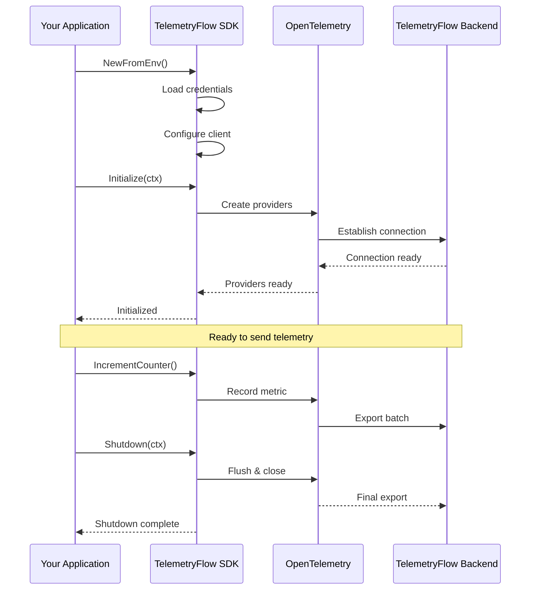

# TelemetryFlow Go SDK - Quickstart Guide

Get up and running with TelemetryFlow in 5 minutes!

## Prerequisites

- Go 1.24 or higher
- TelemetryFlow account with API credentials
- Basic understanding of Go and observability concepts

## Step 1: Install the SDK

```bash
go get github.com/telemetryflow/telemetryflow-go-sdk
```

## Step 2: Get Your API Credentials

1. Log in to [TelemetryFlow Dashboard](https://app.telemetryflow.id)
2. Navigate to **Settings** → **API Keys**
3. Click **Create API Key**
4. Copy your `API Key ID` and `API Key Secret`

## Step 3: Set Environment Variables

Create a `.env` file in your project root:

```bash
TELEMETRYFLOW_API_KEY_ID=tfk_your_key_id_here
TELEMETRYFLOW_API_KEY_SECRET=tfs_your_secret_here
TELEMETRYFLOW_ENDPOINT=api.telemetryflow.id:4317
TELEMETRYFLOW_SERVICE_NAME=my-awesome-app
TELEMETRYFLOW_SERVICE_VERSION=1.1.1
ENV=production
```

## SDK Initialization Flow



## Step 4: Initialize the SDK

Create `main.go`:

```go
package main

import (
    "context"
    "log"
    "time"

    "github.com/telemetryflow/telemetryflow-go-sdk/pkg/telemetryflow"
)

func main() {
    // Create client from environment variables
    client, err := telemetryflow.NewFromEnv()
    if err != nil {
        log.Fatalf("Failed to create client: %v", err)
    }

    // Initialize the SDK
    ctx := context.Background()
    if err := client.Initialize(ctx); err != nil {
        log.Fatalf("Failed to initialize: %v", err)
    }

    // Always shutdown gracefully
    defer func() {
        shutdownCtx, cancel := context.WithTimeout(
            context.Background(),
            5*time.Second,
        )
        defer cancel()
        client.Shutdown(shutdownCtx)
    }()

    log.Println("TelemetryFlow initialized!")

    // Your application code here...
    runApplication(ctx, client)
}

func runApplication(ctx context.Context, client *telemetryflow.Client) {
    // Send a metric
    client.IncrementCounter(ctx, "app.started", 1, map[string]interface{}{
        "version": "1.0.0",
    })

    // Log an event
    client.LogInfo(ctx, "Application started successfully", map[string]interface{}{
        "startup_time_ms": 250,
    })

    // Create a trace
    spanID, _ := client.StartSpan(ctx, "initialization", "internal", map[string]interface{}{
        "step": "startup",
    })
    defer client.EndSpan(ctx, spanID, nil)

    log.Println("Application running...")
    time.Sleep(2 * time.Second)
}
```

## Step 5: Run Your Application

Load environment variables and run:

```bash
# Load .env file (if using direnv or similar)
export $(cat .env | xargs)

# Run your application
go run main.go
```

You should see:

```
TelemetryFlow initialized!
Application running...
```

## Step 6: View Your Data

1. Open [TelemetryFlow Dashboard](https://app.telemetryflow.id)
2. Navigate to your workspace
3. You should see:
   - **Metrics**: `app.started` counter
   - **Logs**: Application startup log
   - **Traces**: Initialization span

## What's Next?

### 🚀 Use the Code Generator

Generate boilerplate code for your project:

```bash
# Install the generator
go install github.com/telemetryflow/telemetryflow-go-sdk/cmd/generator@latest

# Generate integration files
telemetryflow-gen init \
    --project "my-app" \
    --service "my-service" \
    --key-id "tfk_..." \
    --key-secret "tfs_..."
```

This creates:
- `telemetry/` directory with organized helpers
- Metrics, logs, and traces utilities
- Configuration files
- README with examples

### 📚 Explore Examples

Check out complete examples in the `examples/` directory:

```bash
# HTTP server example
go run examples/http-server/main.go

# Worker/background job example
go run examples/worker/main.go

# Complete integration example
go run examples/basic/main.go
```

### 🎯 Common Patterns

**HTTP Server Middleware:**

```go
import "github.com/telemetryflow/telemetryflow-go-sdk/pkg/telemetryflow"

func MetricsMiddleware(client *telemetryflow.Client) func(http.Handler) http.Handler {
    return func(next http.Handler) http.Handler {
        return http.HandlerFunc(func(w http.ResponseWriter, r *http.Request) {
            start := time.Now()

            // Create span
            spanID, _ := client.StartSpan(r.Context(), "http.request", "server", map[string]interface{}{
                "http.method": r.Method,
                "http.path":   r.URL.Path,
            })

            // Call next handler
            next.ServeHTTP(w, r)

            // Record metrics
            duration := time.Since(start).Seconds()
            client.RecordHistogram(r.Context(), "http.request.duration", duration, "s", map[string]interface{}{
                "method": r.Method,
                "path":   r.URL.Path,
            })

            // End span
            client.EndSpan(r.Context(), spanID, nil)
        })
    }
}
```

**Database Query Tracking:**

```go
func TrackQuery(ctx context.Context, client *telemetryflow.Client, operation, table string, fn func() error) error {
    start := time.Now()

    spanID, _ := client.StartSpan(ctx, "db.query", "client", map[string]interface{}{
        "db.operation": operation,
        "db.table":     table,
    })

    err := fn()

    duration := time.Since(start).Seconds()
    success := err == nil

    client.RecordHistogram(ctx, "db.query.duration", duration, "s", map[string]interface{}{
        "operation": operation,
        "table":     table,
        "success":   success,
    })

    client.EndSpan(ctx, spanID, err)
    return err
}

// Usage
err := TrackQuery(ctx, client, "SELECT", "users", func() error {
    return db.Query("SELECT * FROM users WHERE id = ?", userId)
})
```

**Error Tracking:**

```go
func handleError(ctx context.Context, client *telemetryflow.Client, err error, operation string) {
    if err == nil {
        return
    }

    // Log error
    client.LogError(ctx, err.Error(), map[string]interface{}{
        "operation": operation,
        "error_type": fmt.Sprintf("%T", err),
    })

    // Increment error counter
    client.IncrementCounter(ctx, "errors.total", 1, map[string]interface{}{
        "operation": operation,
    })
}
```

### 🔧 Configuration Options

**Builder Pattern:**

```go
client := telemetryflow.NewBuilder().
    WithAPIKey("tfk_...", "tfs_...").
    WithEndpoint("api.telemetryflow.id:4317").
    WithService("my-service", "1.0.0").
    WithEnvironment("production").
    WithGRPC().                          // or WithHTTP()
    WithSignals(true, true, true).       // metrics, logs, traces
    WithTimeout(30 * time.Second).
    WithRetry(true, 3, 5*time.Second).
    WithCustomAttribute("team", "backend").
    WithCustomAttribute("region", "us-east-1").
    MustBuild()
```

**Signal Control:**

```go
// Only metrics
config.WithMetricsOnly()

// Only traces
config.WithTracesOnly()

// Custom combination
config.WithSignals(true, false, true) // metrics and traces only
```

## Troubleshooting

### Connection Issues

```go
// Enable debug logging
import "log"

client, err := telemetryflow.NewFromEnv()
if err != nil {
    log.Printf("Failed to create client: %v", err)
}

// Test with insecure connection (development only!)
client := telemetryflow.NewBuilder().
    WithAPIKey("tfk_...", "tfs_...").
    WithEndpoint("localhost:4317").
    WithInsecure(true).  // Only for local testing!
    MustBuild()
```

### Missing Credentials

```bash
# Verify environment variables are set
echo $TELEMETRYFLOW_API_KEY_ID
echo $TELEMETRYFLOW_API_KEY_SECRET

# Check .env file exists and is loaded
cat .env
```

### Data Not Appearing

1. Check credentials are correct
2. Verify endpoint is reachable
3. Ensure `Initialize()` was called
4. Call `Flush()` before shutdown
5. Check TelemetryFlow dashboard filters

## Best Practices

✅ **DO:**
- Initialize once at application startup
- Always defer `Shutdown()`
- Use meaningful metric/log/span names
- Add relevant attributes for context
- Call `Flush()` before shutdown

❌ **DON'T:**
- Hardcode API credentials
- Create multiple client instances
- Ignore initialization errors
- Skip graceful shutdown
- Use high-cardinality attributes

## Support

- 📖 [Full Documentation](../README.md)
- 💬 [Community Slack](https://telemetryflow.slack.com)
- 🐛 [Report Issues](https://github.com/telemetryflow/telemetryflow-go-sdk/issues)
- 📧 [Email Support](mailto:support@telemetryflow.id)

---

**🎉 Congratulations!** You're now sending telemetry data to TelemetryFlow. Explore the [full documentation](../README.md) to learn about advanced features.
