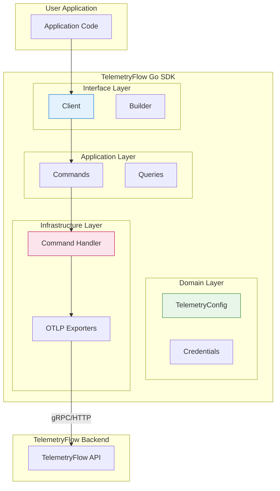

# TelemetryFlow Go SDK Documentation

- **Version:** 1.1.1
- **OTEL Version:** 1.39.0
- **Last Updated:** December 2025
- **Status:** Production Ready

---

## Overview

TelemetryFlow Go SDK is an enterprise-grade SDK for integrating Go applications with the TelemetryFlow observability platform. It provides:

- **100% OTLP Compliance**: Full OpenTelemetry Protocol implementation
- **DDD Architecture**: Domain-Driven Design with clear bounded contexts
- **CQRS Pattern**: Separate command and query responsibilities
- **Code Generators**: CLI tools for quick project setup

### SDK Components

| Component | Description |
|-----------|-------------|
| `telemetryflow.Client` | Main SDK client for telemetry operations |
| `telemetryflow-gen` | SDK integration code generator |
| `telemetryflow-restapi` | DDD + CQRS RESTful API project generator |

---

## Documentation Index

| Document | Description |
|----------|-------------|
| [README.md](README.md) | This file - Overview and quick reference |
| [QUICKSTART.md](QUICKSTART.md) | Get started in 5 minutes |
| [ARCHITECTURE.md](ARCHITECTURE.md) | SDK architecture with DDD/CQRS patterns |
| [API_REFERENCE.md](API_REFERENCE.md) | Complete API documentation |
| [GENERATOR.md](GENERATOR.md) | telemetryflow-gen CLI documentation |
| [GENERATOR_RESTAPI.md](GENERATOR_RESTAPI.md) | telemetryflow-restapi CLI documentation |
| [TESTING.md](TESTING.md) | Testing guide and best practices |
| [BUILD-SYSTEM.md](BUILD-SYSTEM.md) | Build system and Makefile reference |

---

## Quick Start

### Installation

```bash
go get github.com/telemetryflow/telemetryflow-go-sdk
```

### Environment Variables

```bash
TELEMETRYFLOW_API_KEY_ID=tfk_your_key_id_here
TELEMETRYFLOW_API_KEY_SECRET=tfs_your_secret_here
TELEMETRYFLOW_ENDPOINT=api.telemetryflow.id:4317
TELEMETRYFLOW_SERVICE_NAME=my-go-service
TELEMETRYFLOW_SERVICE_VERSION=1.0.0
TELEMETRYFLOW_SERVICE_NAMESPACE=telemetryflow
```

### Basic Usage

```go
package main

import (
    "context"
    "log"

    "github.com/telemetryflow/telemetryflow-go-sdk/pkg/telemetryflow"
)

func main() {
    // Create client from environment variables
    client, err := telemetryflow.NewFromEnv()
    if err != nil {
        log.Fatal(err)
    }

    ctx := context.Background()
    if err := client.Initialize(ctx); err != nil {
        log.Fatal(err)
    }
    defer client.Shutdown(ctx)

    // Send telemetry
    client.IncrementCounter(ctx, "requests.total", 1, nil)
    client.LogInfo(ctx, "Application started", nil)
}
```

---

## Architecture Overview



---

## Project Structure

```text
telemetryflow-go-sdk/
├── cmd/
│   ├── generator/              # telemetryflow-gen CLI
│   └── generator-restfulapi/   # telemetryflow-restapi CLI
├── pkg/telemetryflow/          # Main SDK package
│   ├── domain/                 # Domain layer (entities, value objects)
│   │   ├── credentials.go      # API credentials value object
│   │   └── config.go           # Configuration aggregate root
│   ├── application/            # Application layer (CQRS)
│   │   ├── commands.go         # Command definitions
│   │   └── queries.go          # Query definitions
│   ├── infrastructure/         # Infrastructure layer
│   │   ├── exporters.go        # OTLP exporter factory
│   │   └── handlers.go         # Command handlers
│   ├── client.go               # Public Client API
│   └── builder.go              # Fluent builder pattern
├── internal/
│   ├── version/                # Version information
│   └── banner/                 # ASCII banner
├── tests/
│   ├── unit/                   # Unit tests (DDD organized)
│   │   ├── domain/
│   │   ├── application/
│   │   ├── infrastructure/
│   │   └── client/
│   ├── integration/            # Integration tests
│   ├── e2e/                    # End-to-end tests
│   ├── fixtures/               # Test data
│   └── mocks/                  # Mock implementations
├── configs/                    # Configuration examples
├── docs/                       # Documentation
├── examples/                   # Example applications
├── Makefile
└── README.md
```

---

## Features

### Multi-Signal Support

- **Metrics**: Counter, Gauge, Histogram with exemplars
- **Logs**: Structured logging with severity levels
- **Traces**: Distributed tracing with span events

### Code Generators

**SDK Generator (`telemetryflow-gen`)**:
- Initialize TelemetryFlow integration in existing projects
- Generate example code (http-server, worker, grpc-server)
- Create configuration files

**RESTful API Generator (`telemetryflow-restapi`)**:
- Generate complete DDD + CQRS projects
- Echo framework with OpenAPI/Swagger
- Entity scaffolding with migrations
- JWT authentication and middleware

### Enterprise Features

- gRPC and HTTP protocol support
- Retry with exponential backoff
- Batch processing
- Compression
- Custom resource attributes
- Exemplars for metrics-to-traces correlation

---

## Testing

```bash
# Run all tests
go test ./...

# Run unit tests only
go test ./tests/unit/...

# Run with coverage
go test -cover ./...

# Run with race detection
go test -race ./...
```

See [TESTING.md](TESTING.md) for comprehensive testing documentation.

---

## Build

```bash
# Build SDK generators
make build

# Run linters
make lint

# Run tests
make test

# Generate coverage report
make coverage
```

See [BUILD-SYSTEM.md](BUILD-SYSTEM.md) for build system documentation.

---

## Links

- **Website**: [https://telemetryflow.id](https://telemetryflow.id)
- **Documentation**: [https://docs.telemetryflow.id](https://docs.telemetryflow.id)
- **OpenTelemetry**: [https://opentelemetry.io](https://opentelemetry.io)
- **Developer**: [DevOpsCorner Indonesia](https://devopscorner.id)

---

**Copyright (c) 2024-2026 DevOpsCorner Indonesia. All rights reserved.**
